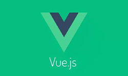
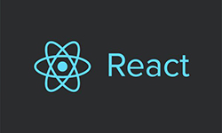
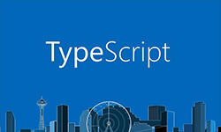
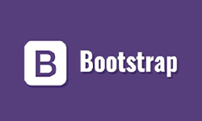
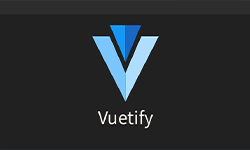
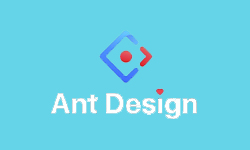
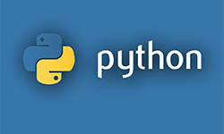
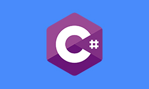
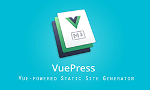

# 中文文档

`本页面的中文文档资源，大部分为官方中文文档，小部分为中文手册等辅助开发工具，仅作为查阅使用。若链接地址有误，本人会及时更正。`

## 前端框架与技术栈

### [Vue3.0中文官方文档](https://v3.cn.vuejs.org/)

 `Vue` (读音 /vjuː/，类似于 **view**) 是一套用于构建用户界面的**渐进式框架**。

### [React.js官方中文文档](https://react.docschina.org/)

 `React` 是一个用于构建用户界面的 JavaScript 库。

### [Node.js官方中文文档](https://nodejs.org/zh-cn/)

 `Node.js`是一个基于 [Chrome V8 引擎](https://v8.dev/) 的 JavaScript 运行时环境。

### [Typescript官方中文文档](https://www.tslang.cn/)

 `TypeScript`是`JavaScript`类型的超集，它可以编译成纯`JavaScript`，并能在任何浏览器、任何计算机、任何操作系统上运行。

### [bootstrap5中文手册](https://www.bootstrap.cn/doc/book/2.html)

 `Bootstrap` 是全球最流行的前端开源工具包，它支持` Sass `变量和 `mixins`、响应式网格系统、大量的预建组件和强大的 `JavaScript `插件，助你快速设计和自定义响应式、移动设备优先的站点。

## 前端UI框架

### [Element-UI 3.0官方中文文档](https://element-plus.gitee.io/zh-CN/)

 `Element`，一套为开发者、设计师和产品经理准备的基于 `Vue` 的桌面端组件库

### [Vuetify-UI 2.0官方中文文档](https://vuetifyjs.com/zh-Hans/)

 `Vuetify`是一个纯手工精心打造的 `Material` 样式的 `Vue UI` 组件库。 不需要任何设计技能 — 创建叹为观止的应用程序所需的一切都触手可及。

### [Ant Design Vue官方中文文档](https://2x.antdv.com/components/breadcrumb-cn)

 这是 `Ant Design` 的 `Vue` 实现，开发和服务于企业级后台产品。

## 后端框架与技术栈

### [Python官方中文文档](https://docs.python.org/zh-cn/3/)

 `Python`提供了高效的高级数据结构，还能简单有效地面向对象编程。`Python`语法和动态类型，以及解释型语言的本质，使它成为多数平台上写脚本和快速开发应用的编程语言。

### [C#官方中文文档](https://docs.microsoft.com/zh-cn/dotnet/csharp/)

 `C#`是微软公司在2000年6月发布的一种新的编程语言,运行于`.NET Framework`和`.NET Core`(完全开源，跨平台)之上的高级程序设计语言。

## 辅助工具

### [Vite官方中文文档](https://cn.vitejs.dev/)

 `Vite`（法语意为 "快速的"，发音 `/vit/`，发音同 "veet")是一种新型前端构建工具，能够显著提升前端开发体验。

### [Git官方中文文档](https://git-scm.com/book/zh/v2)

 `Git` 是一个开**源的分布式版本控制系统，**用于敏捷高效地处理任何或小或大的项目。 `Git` 是 `Linus Torvalds` 为了帮助管理` Linux` 内核开发而开发的一个开放源码的版本控制软件。

### [VuePress官方中文文档](https://vuepress.vuejs.org/zh/)

 `Vue` 驱动的静态网站生成器,以 `Markdown` 为中心的项目结构，以最少的配置帮助你专注于写作。

