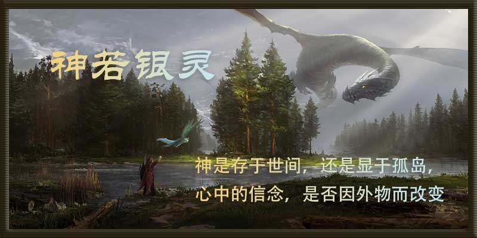

# 
神若银灵

***

## 大纲

### 人物表

| 名字       | 角色   | 种族、身份、职业                         | 性格             | 天赋                       | 出现章节   |
| ---------- | ------ | ---------------------------------------- | ---------------- | -------------------------- | ---------- |
| 伊凡       | 男主角 | 人/神族                                  | 冷峻             |                            | 大部分章节 |
| 银龙       | 酱油   | 神族                                     |                  | 治愈能力                   | 1.1        |
| 索菲亚     | 龙套   | 人族、伊凡养母、人族公主、占星师         | 温柔、慈爱、俏皮 | 未卜先知的能力             | 1.2        |
| 贝尔卡村长 | 酱油   | 人族，贝尔卡村长                         | 慈祥             |                            | 1.2        |
| 艾伦       | 龙套   | 人族。大魔法师                           | 睿智             | 精通各类魔法               | 1.3        |
| 希尔       | 酱油   | 兽族，独角兽，宠物坐骑                   |                  | 搜寻纯正灵力的能力         | 1.3        |
| 拉莫斯     | 酱油   | 人族，巫师（血巫师）                     |                  | 召唤生灵，医术             | 1.4        |
| 科尔纳     | 龙套   | 人族，魔法师，米提亚尼斯皇家魔法学院院长 | 吝啬，多疑       | 镜头各类封印魔法与探索魔法 | 1.5        |
| 希多       | 酱油   | 人族，骑士，第一任人王                   | 冷静             | 出色的领导能力             | 1.5        |

### 时间线

| 时间（纪元） | 重大事件 | 备注与补充 |
| ------------ | -------- | ---------- |
|              |          |            |

### 地点

| 地点名称   | 所属位置（五界一岛） | 发生事件                       | 相关补充 |
| ---------- | -------------------- | ------------------------------ | -------- |
| 神灵岛     | 神灵岛               | 伊凡梦境                       |          |
| 贝尔卡村   | 新界                 | 伊凡穿越迷雾                   |          |
| 迷雾森林   | 新界                 | 偶遇艾伦大魔法师，寻找空谷幽兰 |          |
| 空谷       | 新界（迷雾森林）     | 幽兰花开在空谷中的神秘园中     |          |
| 神秘园     | 新界（空谷）         | 找到幽兰花                     |          |
| 米提亚尼斯 | 新界                 | 伊凡学习，追寻父亲踪迹         |          |

### 线索、伏笔、道具

| 道具     | 线索                       | 伏笔                                       | 出现章节 | 备注                       |
| -------- | -------------------------- | ------------------------------------------ | -------- | -------------------------- |
| 龙珠     | 由银龙口中所吐之珠         | 珠子和银龙一样有治愈的能力                 | 1.1      |                            |
| 银色长剑 | 神灵所赠之剑               |                                            | 1.1      | 指代银龙                   |
| 迷雾     | 神灵岛迷雾，村庄贝尔卡迷雾 | 十五年前，伊凡的父亲在迷雾中消失           | 1.2      | 迷雾中有祭坛，类似于传送点 |
| 空谷幽兰 | 圣洁之花、希望之花         | 艾伦好友拉莫斯被邪恶魔法袭击，需要空谷幽兰 | 1.3      | 象征圣洁与希望             |
| 蓝莲花   | 向往之花，勇气之花         | 空谷之中，神秘园盛开之花                   | 1.4      | 象征勇气                   |

### 总纲

**主角：**

**世界环境：**

**主线剧情（简介）：**

**预计字数：**

## 卷纲

### 第一卷

### 章纲

1.1 伊凡每天做梦成为一个神灵，直到有一天他梦到银龙，他骑到了银龙的背上，银龙幻化成人形，带他进入神灵岛迷雾中心，见到了银灵果树。

1.2 伊凡从梦中醒来，和他的母亲索菲亚说起了梦中的情形，她从中得知后，便问起了梦中“迷雾”相关的内容，经过确认之后，她向伊凡说起他父亲失踪的事情（和迷雾有关，但其实是谎言，她只想伊凡快速成长），伊凡犹豫了一个晚上他还是去了村庄不远处的那片迷雾森林中。

1.3 在迷雾森林中，伊凡见到了一只独角兽，独角兽带着他去见了正在寻找空谷幽兰的艾伦大魔法师，艾伦打算引荐伊凡去米提亚尼斯皇家魔法学院。

1.4 艾伦和伊凡寻找幽兰花，却无法找到，伊凡闭上眼睛，空谷变成了一片‘神秘园’，园地开满了蓝莲花，伊凡从蓝莲花中找到了幽兰花。

1.5 艾伦带伊凡来到米提亚尼斯，艾伦向皇家魔法学院院长科尔纳推荐伊凡，不许，只能退而求其次，让伊凡先在米提亚尼斯住下。

## 前言

`原版本为五界传说，现阶段打算重写。`

## 第一卷 新界

### 第一章 骑在银龙的背上

伊凡是一个可爱且充满想乡力的小男孩，从他出生以来，他的母亲总是夸赞他有一双神灵一般澄澈的眼睛。每当他扑闪他那对晶莹透亮的大眼睛，他的母亲总会在一旁，为他唱起关于神灵的歌谣。

随着年纪的增长，他已不愿意听他母亲的歌谣，因为这些歌谣歌颂的对象是那些高高在上的神灵，而不是他这个可爱的小男孩。

为了让自己的耳朵里少一点“神灵”，他总是一个人依靠在家门口的老树边，幻想着有一天自己能突破生死的界限，成为灵力之巅的神灵。不知是母亲的诱导，还是一种莫名其妙的直觉，他对自己能成为神总是深信不疑。

一年又一年，母亲眼中的小男孩也长成了一个十六岁的大男孩。

或许是对神灵的期盼一天胜过一天，他做了一个很长的梦：梦里他穿过了灰色的雾霭，翻越无数的山岭，爬上穿云的神柱，终于来到了神灵居住的神灵岛，在神灵岛中心的浓雾中，一位神灵将他手中的银色长剑赠予了他，并嘱咐他，等你真正的拥有它，你便会成为那至高无上的神灵。

当伊凡醒来之时，他的手中并没有那把银色的长剑，但伊凡对这个梦深信不疑，他开心地走到母亲的身边，并向母亲说明了那遥远而真实的梦境。

他的母亲听了他的话，不知是安慰还是鼓励，告诉他，如果有一天，他梦到了银色的生灵，那么他就有可能成为神，因为神会选择这些幸运的孩子，作为传承的对象，他们会给予这些孩子一颗银色的神物。

在伊凡母亲的口中神的灵力都来自一棵古老的银灵果树，只有吃下神给予的银灵树的果实，并且将神的灵魂容纳到身体里，才能接受神的传承；只有最为古老的神才不会为传承的事而苦恼，他们都是那棵银灵果树的果实，拥有最为古老而神圣的神力，而这些神力不会因为时间和空间而改变。

接下来的几个月，他又做了几个不一样的梦，但不出意外，他都看见了银色的生灵，这些银色的生灵，不仅晶莹靓丽，同时还有强大的灵力……

天空中有三轮明月，不知是明净的月光将整个天空照亮，还是这洁白的天空将月亮衬的更为圣洁。

伊凡脚下踩着绿色的草地，手中也握有一把银色的长剑，这把长剑正是之前雾中神灵赠与他的。

他没有停下脚步，恍惚中，一声巨大的龙吟传入了伊凡的耳中，伊凡没有畏惧更没有后退，有的只是兴奋。太多次了，他在梦中见过太多银色的生灵，他还想要看到更多，了解更多。他想知道这样的梦境是神灵带给他的福祉，也许当梦醒之后，他也能见到他们，这些神奇的银色生灵。

很快，一条银龙终于将自己庞大的身躯显露，它渐渐地落到伊凡的身边。伊凡靠近了些，他也想看看这条巨龙的来意。

这条巨龙浑身布满了银色的鳞甲，身子同长蛇一般健硕，四只爪子如鹰爪一般犀利。只有一对细长的龙须漂浮着。它长大了嘴，呼出一口云雾，一颗银色的珠子从云雾中缓缓而出，落到了伊凡的另一只手上，浮在半空。伊凡想要接过珠子，紧紧握住，却发现这颗珠子居然能穿越自己的身体，扎到自己的心脏。

“孩子，你我终于在此相见了。”巨龙居然张口说话了，这倒是让伊凡吃了一惊，之前他遇到的银色生灵并没有像这条银龙一般，拥有张口说话的本事。

“你……你是在和我说话吗？”伊凡指了指自己，表示深深的怀疑。

银龙似人类一般点了点头，“我等了你好久。”

伊凡更是不解了，于是便问道：“你在等我，可我此刻明明在梦里。我为什么会是你要等的人，你是不是在骗我！”

银龙吐出浅白的舌头，在伊凡的眉心轻轻一点。不一会儿，伊凡的身体竟不受控制地漂浮到银龙的身后。他两脚岔开，身子轻飘飘地晃动两下，向前一倾，竟舒适地骑到了它的背上。似乎是感到亲切，伊凡又不自觉地抱住了银龙的脖颈。细腻的银鳞，在伊凡的手上泛出一丝丝星光。他又不自觉地将目光移到那片原本明净的天空。

不仅仅是三轮皎洁的月盘，更是这静谧的夜色，也为梦境多增添了一分神秘。鳞片，银色的鳞片，如被风吹走的花瓣缓缓飘向远方，逐渐汇聚成了一条银色的河流。

“你看到了吗？”这是银龙的声音。

伊凡一晃神，银龙背上晶莹的鳞片竟然全部飞散而去，而后又朝着同一个方向汇聚……

“你看我的鳞片像不像是一条河流，总有一天，你会踏在这些银色的鳞片上，直到走到这条河的尽头，河的尽头，我也会在那一头等你，直到你也成为我。！”

银龙说了一段无法理解的话。谁会知道它在期盼些什么，伊凡会成为它？自己也会变成一条银龙？

想到此处，伊凡连忙抓住脑袋。并用指甲拼命地抓了几下。他不由地又想到自己的手指头慢慢变成爪子，身上开始覆出一层又一层的鳞片，自己由直立缓缓趴下身子，脸上慢慢长出一对长长的龙须……

“孩子，你不要多想，我相信总有一天，你会明白这其中的意义，你现在只要跟着我去银河的另一端。”

银龙是看到伊凡局促的表情，说出了安慰之语，它好像对伊凡很了解，就像了解它自己一样。

伊凡不假思索地答应了下来，他还不知道，接下来他会面对些什么。

银龙身上地鳞片已完全褪去，但由银鳞汇聚成地银河却没有消散，那条银河不知何时却成为了一座硕长的铺满银鳞的桥。

“跟我来！”

银龙扭动着巨大的身躯，走到桥的这一头，缓慢转动身子，一道银色的光芒竟不自觉地照射到银龙地身上。

伊凡连忙退后两步，将双手遮住双眼。这银色的光辉，比之前要更亮一些，还是让他产生了一丝畏惧。

当光芒褪去，银龙巨大的身躯已然不见，取而代之的是一个中年人。他披着红色的长袍，除了那一双深黑色的眼睛，身上都是一片银白。

“你是……我……”伊凡将刚拿开的双手又捂住了嘴巴，他应该是想到了，眼前的这个中年人应该就是刚才的那条银龙，只有神灵的力量才能让银龙变为一个人类。

“我就是刚才那条龙，孩子，我们走吧。”

说完，中年人便伸出一只银白的右手。伊凡还是没有多想，伸出左手，与中年人的手握在一起。

“你要带我去桥的另一边吗？可你不是和我说，我会在有一天，自己一个人走到桥的另一边吗？”

中年人笑了笑，解释道：“你想自己一个人走过这座桥吗，不过现在的你，还不是很适合。你现在是在梦中，等到你长大了，有足够的力量爬上神灵岛，来到梦里的这个地方，到时候，你会亲自走过这里。”

伊凡问道：“我为什么要走过这里，去桥的另一边？”

中年人道：“你就当是神灵的指示吧，你不是想成为不死不灭的神灵吗，如果连这点愿望都不能满足神灵，神灵又怎么会将他的传承赠予你呢！”

伊凡狠狠地点了一下头，他喃喃道：“没错，我必须接受神灵赐予我的挑战。”

中年人拍了拍伊凡的肩膀，脸上露出一丝浅笑，“走吧。”

银色的长桥由草地延申到神灵的中央，岛的中央是一片巨大的迷雾，而桥的另一端应该就在这片迷雾之中。

中年人和伊凡走在桥上，步幅不大，但按照他们的速度，还不知道要到什么时候才能走到桥的另一头。

“叔叔！”

伊凡不知该怎么称呼银龙，只能叫了一声叔叔。

“怎么啦？”

两人停下了脚步。

“我们什么时候能够走到另一边？”

中年人笑道：“孩子，你是走累了，还是厌倦了。”

伊凡道：“我两个都有。”

中年人指着伊凡的胸膛道：“其实桥的另一端就在你的心里，但此刻，你的心并没有告诉你什么时候你才能走到终点。”

“那我要怎么做？”

“你现在要的是静下心来，这是你的梦，你只要把自己的意志融入到梦境之中，你就可以去到你想去的地方。”

“可是……”

“你闭上眼睛，想象一下桥的另一头是什么。”

伊凡闭上了眼睛，两人就像是两道光柱，急速而出，迅速穿过浓浓的迷雾。

当伊凡睁开眼睛，两人果然出现在了桥的另一头。

伊凡走下桥头，环顾四周，周围是稀疏却又洁白的迷雾，依稀可见的只有一个模糊的轮廓，这个轮廓却是树的形状。

伊凡回头看了中年人一眼，中年人像是明白伊凡心中所想，“不要犹豫，你想去看看，就仔细地去看看。”

“嗯”，伊凡朝着那树形轮廓跑了过去。

轮廓越来越清晰，伊凡身旁的浓雾也越来越淡，直到完全消失。

这迷雾中的轮廓果然是一棵树，但这棵树却有着千万种的非凡。

它不似寻常的树木那般充满生机，绿意安然，而是多了几分死气，巨大的树干分散而卷曲，依稀能在枝干上看到几颗暗银色的果树，树根却直截而下，扎入一块深灰色的岩石中。

这难道是？

伊凡似乎是想到了什么，它曾听他的母亲说起过银灵果树。

传说银灵果树是一切生命的起点，所有的古神都是由银灵果树上的银灵果幻化而来……

他露出一丝微笑，可就当他笑意刚起，他却从睡梦中清醒过来。

> 《银の龙の背に乗って》（《骑在银龙的背上》）（ぎんのりゅうのせにのって），中岛美雪第38张单曲 ，发行于2003年7月23日。主打曲《银の龙の背に乗って》是柴崎幸及吉冈秀隆主演的日剧《五岛医生诊疗所》第一二部的主题曲。《最初的梦想》采用了这首歌的曲子。网友经常误以为银龙是指电视剧中，主角那辆叫“银龙”的自行车，“骑在银龙背上”代指骑着自行车穿行于村落之间的乡间医生。但中岛美雪亲自回应过，银龙颜色的来源是医生手里的手术刀。——内容来源：百度百科

### 第二章 迷雾

伊凡睁开双眼，发现自己躺在了床上，床的一边，有母亲守候，母亲索菲亚泪眼婆娑，眼中尽是心疼之色。

“我的伊凡又做梦了？”

索菲亚用毛巾擦拭伊凡的额头继续说道，“这次伊凡又梦到了什么，还有那些银色的生灵吗？”

“嗯！”伊凡无力地点点头，看来天天做梦也是很累地事情。

“那伊凡还看见了什么？”

伊凡坐了起来，接过索菲亚手中的毛巾，亲昵地说道：“母亲，这次我看到了一条银龙，那条银龙带我去了神灵岛的中心。”

索菲亚听伊凡提起神灵岛，原本舒展的眉头突然皱了起来，她好像对神灵岛有着不好的印象。不对，每次伊凡提起神灵岛，索菲亚都是这个表情。

“还有呢？”索菲亚问道。

伊凡继续说道：“神灵岛的中心有很大一片迷雾，迷雾的中心有一棵银灵果树。”

“你说什么！！！”

听到“迷雾”二字，索菲亚的心神一晃，随后，她连忙控制住了自己，又急忙问道，“你在梦中看到的迷雾是什么颜色的？”

伊凡见母亲这慌忙的模样，思索片刻便说道，“灰色，又稍微带一点白色。”

索菲亚闻言，心中一阵绞痛，身子有点不稳。难道是同样的迷雾？

她想起自己的丈夫夏尔，当时他就是因为这迷雾足足失踪了十五年，留下她们母子相依为命。

“母亲，你怎么啦？”伊凡关切地问道。

他想不到简简单单的一个梦母亲竟然会有这么大的反应。

“没事。”索菲亚这一次坐到了伊凡的床边，继续说道，“伊凡，你不是一直想知道你父亲的消息吗？”

伊凡疑惑一下，但内心还是激动了，十五年了，自从伊凡出生以来，他的母亲从未向他透露过他父亲的消息。

“母亲，我的父亲……”

犹豫一番，索菲亚还是决定将曾经的往事告诉伊凡。他的伊凡也已经到了该知道一切的年纪了。

索菲亚道：“你的父亲是贝尔卡村唯一的牧师，十六年前，我和你父亲生了你。就在你一岁的时候，在贝尔卡村西面的群山和森林中突然结起了一片浓雾，浓雾遮蔽了村民打猎的场所，闯入了那片森林中的人们，无论是谁，只要进入了那片迷雾中，就再也没有出来过。

先期只有几个人不知所踪，后来，随着寻找的人越来越多，失踪的人也越来越多。村里的人们也越来越着急，直到有一天，村长找到了你的父亲，

因为你父亲是这附近唯一的神职人员，所以村长只能拜托他去联系有能力的生灵来驱散这片迷雾，找到失踪的人，拯救整个村庄。但你的父亲知道要走出村庄求援，必须要穿越那片迷雾，只有往西他才能找到他所信奉的神殿，去找到那些更为强大的生灵……”

伊凡似乎是猜到了结局，但他还是忍不住问了，“我的父亲走出那片迷雾了吗？”

索菲亚的脸颊上突然划出两颗泪珠，“我不知道。”

伊凡用袖子拭去他母亲的眼泪安慰道：“母亲，我相信父亲一定会安然无恙的。”

十五年的煎熬实在是太长，到了这一刻，索菲亚才得到一点点的宣泄，好在她的儿子已长大成人，懂得体谅自己的母亲。

“母亲，你不要难过，我相信终有一天，我们能找到父亲的。”

“都怪我，我当初就应该拦着你的父亲。”

“母亲，你不要这么说，如果我是父亲，我也会想办法去找出去的路。”

索菲亚突然像疯了一般抱住伊凡，她大吼道：“你绝对不能出村，你如果出去，你就不是我的儿子，听到没有！”

伊凡也清楚母亲的苦心，他现在是母亲唯一的命根，如果连他也消失不见，母亲绝对会陷入疯狂，她已经失去了丈夫，不能再失去儿子了。

伊凡抱住母亲不再言语，只是拍着母亲的背……

第二天天亮，伊凡已踏上了西出的行程，他不想母亲伤心，但他的内心更有一种冲动，一种莫名的冲动。

他想要离开这个他生活十六年的村庄，去寻找自己的父亲，等到他找到父亲后，他再去寻找梦中的神灵岛，然后去成为那至高无上，不死不灭的神灵。

他给他的母亲留了信，他虽然知道这样不好，对不起自己的母亲，但他已没有过多的选择，至少他如果还在村子里，他只能陪着母亲，其他什么都做不了。

“你想要走吗？”村口还有一个人站着。

伊凡上前一看，那人拄着拐杖，向西方的迷雾一直看着。这位老人是贝尔卡村的村长，十五年来，每天的这个时候，他总是会望向远处那一片迷雾。

“村长爷爷，您知道我要走？”

伊凡低下了头。

“你向你的母亲告别了吗？”村长问道。

“没有。”

村长叹息一声，“你是不应该和他告别，你长大了，已经长成一个大人了，是不应该什么事情都让你母亲知道的。”

伊凡微微一愣神，他想不到这个和蔼的村长爷爷居然会这么说。

村长又继续说，“十五年了，我对不起你的母亲，当年若不是上门去求你的父亲，你的父亲也不会失踪，我知道她的心里是恨我的，可她却只能装作若无其事。”

伊凡咬了咬嘴唇，不知该说些什么，他有了一丝犹豫。

村长道：“也许你的母亲已经将一切都告诉了你，但你也知道，你的母亲并不想让你离开。”

伊凡道：“我想离开这里，村长爷爷！”

村长布满皱纹的脸突然一抽，“你果然是和你的父亲一样，但你也知道，你一旦离开这里，迎接你的会是什么。”

伊凡咬了咬牙，“我知道，但我想要试一试。”

村长的嘴角微微一笑，“十五年了，这十五年来，我们有太多的人离开了这里，没有人知道他们去了哪里，我宁愿相信他们只是不想在这个落魄的村庄里老死。外面的世界充满精彩，外面的世界也同样充满无奈，你既然有这个心，我自然不会拦住你，但你要知道，你终有一天要回来，因为你的母亲还在这里，除非你想要你的母亲也跟着出去，然后来找你。”

“村长爷爷，我的父亲还有那些出去的村民都还活着吗？”

村长收起拐杖，背过身去，口中喃喃，“走吧，都走吧，出去了也好。”

伊凡没有告别，他只能一个人默默离开……

“你来了。”原本沉默的村长，朝着迷雾说了一句。

“嗯。”来者竟然是索菲亚，“伊凡已经离开了吗？”

“他已经走了！”村长道，“你怎么舍得你的孩子，他还只有十六岁！”

说起伊凡，村长的情绪便上来了，老人总是疼爱身边的孩子的。尤其伊凡是他看着长大的。

“我的孩子已经长大了，他必须要学会独立的生活，像他的父亲一样。”索菲亚说道，“他是神灵赐予我的孩子，终有一天，神灵会将我的孩子收回去，与其默默地告别，还不如让他主动地离去。让他接受神灵赐予他的挑战。”

村长叹息道：“但你不应该骗他，索菲亚，他是你的孩子，作为一个母亲，你怎么能这么对待你的孩子，还有，你让他这么离开了，他怎么找到他的父亲呢？”

索菲亚露出狡黠的笑容，“是他的父亲对不起我，所以我必须让我的孩子把他找回来，亲自向我道歉，十五年了，不长也不短，他当年能撇下自己的孩子，也该让他知道他的孩子为了他，不顾千山万水地去找他。”

村长无奈地摇头，“你们两个人的事情，我实在搞不明白，何必如此呢？”

索菲亚笑道：“这是我和他的约定，等到伊凡成年了，伊凡就会去找他，我昨晚在伊凡的背包里施展了定尘术，无论他在世间的哪一个角落，我都能找到伊凡，再说以他的能力，他应该已经知道伊凡已经出发了。”

说完，索菲亚还是拆开了伊凡给她留的信：

亲爱的母亲：

我离开了，当你告诉我父亲消息的时候，你知道我有多么激动。

我从出生以来就没有见过我的父亲，我真的不知道该怎么面对你，我要去找到他，无论生死。

我离开了，虽然前途未知，我也不知道我能不能活着回来，但我会留下对你的思念。

当天空挂上三轮月亮的时候，我便会回来看你，这是我和你的约定。

愿母亲一切安好，勿念！

看完这封信，索菲亚还是留下了眼泪，这是一个孩子对于母亲最为真挚的感情，作为母亲的，哪会不动容。

“索菲亚，你说外面的世界真的这么精彩吗？城堡的鲜花，教堂的琉璃，骑士的战马，魔法师的水晶球这些真的让人痴迷么？”

村长从索菲亚的手中抽过信件，也看了伊凡留下的信，他的心里很不是滋味，“伊凡真是一个好孩子，索菲亚，你说有一天我走了，这个村子里是不是一个人都没有了。”

“您不会走的，您是看着我长大的，你若是走了，我的父亲就不会饶了我的！”索菲亚转泣为笑，如小女孩一般地吐了一下舌头。

村长见索菲亚撒娇，褶皱的老脸也跟着笑了起来，“你要早点通知你的丈夫，他是一个不靠谱的家伙，十几年来一直是这样，我都不明白当年你是怎么看上他的，还有我可不想伊凡这孩子在外面受苦。”

见村长不断的唠叨，索菲亚只能点头回应，“知道啦！”

> 《迷雾》是中国内地男歌手李健演唱的歌曲。由李健填词作曲，收录在李健2015年8月发行的专辑《李健》中。《迷雾》的歌词是专辑里李健写得最长、创作时间最长，也参与了演奏。是首充满社会寓意的歌曲，歌词酝酿很久。这首歌讲的不只是在北京的人，更是整个时代的状态，很多乡村城镇的差异、环境已经够不堪，最终恶劣的却还抵不过人的状态：农民失去土地一无所有。这些人们从小所受的教育比较单纯，于是他们「不敢怀疑因为走不出你的善良」，因着纯朴的善良，用逆来顺受、默默忍耐的态度来接受现实。——内容来源：百度百科

### 第三章 空谷幽兰

从村口离去，大约是过了一个时辰，伊凡终于走到了迷雾遮蔽的森林前。

这是一片翠绿的森林，在浓雾的环绕下更显得仙气十足，森林的深处，是连绵的群山。伊凡甚至能从中感受到灵力从森林中飘散而出。似乎是有一股神奇的力量总在牵引着伊凡，让他的内心对其极其的向往。

伊凡从背后取下背包，他打开背包，从背包中拿出一把短刃，和一张地图。这把短刀是当初村长爷爷送给他十五岁的礼物，而这张地图则是他父亲的遗物。

他望着这两个物件，喃喃道，“母亲，村长爷爷，我已经迈出了第一步，希望我能找到我的父亲。”

他看完地图，就将地图放回背包里，顺手又将短刃收到腰间，再将背包合上，然后背上。

森林入口处淡淡的迷雾并没有阻隔伊凡的脚步，他已走了一会儿，直到他完全看不清他刚才进来的入口。

伊凡曾从村长爷爷的口中得知，如果当一个人迷失在陌生的环境中，首先第一件事就是抬头看天空的太阳，通过阳光和自己的影子就能找到一个合适的方向，寻找出路，如果因为外物遮住了阳光，则可以通过四周的植物来判定自己的方位，一般情况下，植物朝南一面的枝叶会长地茂盛一些。

然而，此地的树木却有些不同，可能是由于迷雾的遮蔽，这儿的植物很少接受充足的阳光，导致伊凡完全看不出哪一面的枝叶更加茂密一些。

伊凡第一次出远门，毫无一点野外生存的经验，一下子就蒙了头脑。他虽然已经比他的母亲高出一截，但他的心智似乎还是和从前一样。以前，伊凡经历的所有事情，都由她的母亲帮她处理，而此刻他只能一人面对。

他蹲坐在原地，不知该如何是好。

不知是磨了多少的时间，他的肚子也开始不争气地叫了起来。

伊凡从背包中取出两个面饼，大口吞咽起来。等吃完之后，他看着背包中为数不多的面饼，甚至开始后悔起来，早知道他出门的时候就该多带一点口粮。

“我该怎么办？”

他向四周望去，密密麻麻的灌木像是将他完全包围起来，只有一条细长的小路，两旁的树木向远处延申，越来越密，直到完全消失于迷雾中。

伊凡咬牙，身子向上一挺，站立起来，他似乎做了决定。“就这条路吧。”

沿着这条小路，伊凡的步幅更快了一点，他要赶紧走到小路的尽头，尽快找一个落脚的地方，不然，夜晚的到来，可不是和他开玩笑的。但这条小路却像是他梦中的银桥一样，始终是走不到头。

他依稀又想到梦中银龙对他说起的那一句话：其实桥的另一端就在你的心里，但此刻，你的心并没有告诉你什么时候你才能走到终点。

伊凡喃喃道：”不想了，只能这么办了！“

他闭上了眼睛，脑海中开始想象一副幽静的画面：

那是一片翠绿的草地，草地边上有一条潺潺的小溪，在小溪的另一头，有一只白色的独角兽，它低下头，伸出粉嫩的舌头，喝着清澈的溪水。

很快，他的身子就化作了一道银色的光柱，向森林的深处穿过，直接飞往森林后方的群山之中。

潺潺的溪水声，传入伊凡的耳中，伊凡的脸庞也感受到了一点湿度，他缓缓睁开眼睛。眼前的一切，不禁让伊凡大吃一惊。

他看到了什么！他看到了一只独角兽，而这只独角兽和他梦中的样子一模一样。同样的银角，同样的白色身躯，同样的粉色长舌。他坐了起来，四周是一片翠绿的草地，而草地的一边还是那条一模一样的小溪。

伊凡长大了嘴巴，不知是该惊呼，还是颤抖。难道自己真的是拥有神灵一样的灵力吗？

”你醒了，孩子！“

呼唤伊凡的是一位老者，他拄着一根细长的魔法杖，身上披着一件白色的长袍，胡子直直地垂到胸前。他应该是一位资深的魔法师。

”我这是在哪儿？你又是谁？“伊凡问道。

艾伦笑眯眯地说，”我叫艾伦，是一个魔法师，这儿是空谷！“

”空谷？“

伊凡嘀咕一声，但仍不知道”空谷“是个什么地方。

”孩子，你叫什么名字，你怎么会在这个地方昏迷的？“艾伦问道。

”我叫伊凡……我不知道……“伊凡不知该怎么回答。他总不能说，他是靠着自己的想象力来到这儿的吧。

艾伦见伊凡不想回答，也就岔开了话题，”孩子，看你的样子应该是一个学生吧。“

”学生？“伊凡还是摸不着头脑，他这十六年来，从来没有人向他说起”学生“这个词。

艾伦的心咯噔一下，他感觉自己已经触及了伊凡的自尊心。在这个世界的人类，只有少数的贵族和优秀的生灵，才能进入学院，成为学院的学生，毕业之后成为相关的神职人员（学者、牧师、魔法师、巫师、骑士……）。

”我不是学生，如果我成为学生，会有什么样的好处。“伊凡的眼睛一亮。

他此刻想的是成为学生会能学到什么样的本事，如果学成了，对自己寻找父亲有什么帮助。

艾伦听伊凡这么问，也沉思了一会儿，他已经猜到眼前的大男孩是一个贫民的孩子。但却又不完全对，这儿是预言中的空谷，一个平凡的生灵是无法来到这儿的。

艾伦叹息一声，似乎在感叹眼前这个孩子的资质，他不去学院学习，实在是太可惜了。

艾伦甚至在伊凡的身上，感受到了一丝丝稀薄的灵力。伊凡应该不是一个甘于平凡的生灵。

见艾伦不回答，伊凡的眼光暗淡了下来，”艾伦爷爷，您说的‘学生’是不是对我没有什么帮助。“

伊凡这么说倒是让艾伦有了兴趣，按照伊凡现在的样子，他已经错过了最佳学习的年纪，但他身上的灵力，却又是一般魔法师所不具备的。

艾伦随手将魔法杖一挥，那条原本流动的小溪，突然被一阵白气包裹，白气褪去，溪面上瞬间凝结了一层厚厚的冰川。

他问道：”伊凡，你想拥有这样的能力吗？“

”我可以吗？“

伊凡显然是被艾伦的魔法给震住了，他想不到眼前的老者竟然有这样的能力，但他还是有一丝丝的犹豫。他地梦想是成为一个神灵，而并非是一个魔法师。

艾伦笑着说，”如果你愿意的话，我可以带你去米提亚尼斯皇家魔法学院。“

伊凡皱了一下眉头，”我去那里做什么？我只要这样的力量，不想去那么远的地方。“

艾伦解释道，”你想要拥有这样的能力，首先需要大量的学习，单单我一个人是无法满足你的愿望的，但在学院里，你能阅读很多的典籍，通过更多的途径来学习，从而成为像我一样强大的人。“

艾伦向伊凡伸出了橄榄枝，但这对伊凡来说还不够。他犹豫了一下说道，”我能拜托您一件事吗？“

艾伦的好奇心又多了一分，看来，眼前这个大男孩并非是想象中那般简单。

”伊凡，是什么事？“

”您能帮我找到我的父亲吗？“

伊凡有些傻愣愣的问，他是一个涉事未深的大男孩，若是换做旁人，早对他嗤之以鼻了，不过幸好，艾伦是一个热心的魔法师。

”你的父亲叫什么名字？“艾伦问道。

”夏尔！“

艾伦捋了捋胡子，脑海中已有了一个印象，但他又看了一眼伊凡，心里立刻否定了一个想法，伊凡应该不是”他“的儿子。

”您认识我的父亲吗？“看艾伦的神情，伊凡的心中燃起了一丝信心。

艾伦摆手否定，”对不起，我并不认识叫夏尔的人，你的父亲是神职人员吗？“

”我的父亲是一个牧师。“

艾伦更加确定了，尽管他先前的猜测是错误的，”伊凡，如果我愿意帮你去寻找你的父亲，你愿意跟着我去米提亚尼斯吗？“

”我愿意！“

伊凡毫不犹豫地答应了，他似乎从头到尾都没有考虑过：艾伦是不是一个骗子，甚至是一个坏人。

”我得感谢你愿意相信我，但在之前，你还得跟着我去办另一件事。“

”是什么事情，我能帮到您吗？“

伊凡的心情大好，他想不到他刚离开贝尔卡村不久，便有人来帮助他，而且帮助他的会是一个和蔼可亲的老人。

艾伦也很开心，得到别人的认同总是一件好事，他解释道，”我有一个老朋友，六年前被黑魔法所伤，必须要有空谷中的幽兰花来疗伤，我找到了现在，还没有找到，但我已经找到了空谷这个地方，相信不会有多久，我就能找到它，你愿意帮助我吗？“

伊凡道：”您都找不到，更何况是我。“

艾伦听完之后，哈哈大笑，”伊凡，我这个老头子年纪大了，本来就不怎么看得清东西了，你有一双像神灵一样清澈的眼睛，我相信你一定能找到的。“

伊凡楞了一下，他从来不觉得自己的眼睛有这般神奇，可无论是谁，见到他都会夸耀他那双澄澈的眼睛，这或许是神灵对于他的恩赐，又或许他真的拥有一双神灵的眼睛。

艾伦接着说道，”这片空谷是预言中的圣地，只有拥有奇特灵力的生灵才能到达这里，我相信你是那个预言中的人。“

艾伦向伊凡说明了情况，这也让伊凡的心中更加确信，他的确是被神灵选中的孩子，他在未来也一定能够成为神灵。

> 《空谷幽兰》是许巍作词、作曲并演唱的歌曲，该曲收录于许巍2012年12月12日发行的专辑《此时此刻》中，许巍和家人亲戚到终南山游玩，行至秦岭深处，清幽寂静，山谷弥漫着淡淡暮霭，夕阳西下，落日余晖，灵感突发创作了这首歌，之后花了一年时间，记满了一本笔记，歌词创作深受诗经国风之影响，歌曲中隐含着弘一法师的生命态度。——内容来源：百度百科

### 第四章  神秘园与蓝莲花

空谷的溪水已经解冻，寒气也像一层细细的迷雾，漂浮在水面上。

莫约过了半个时辰，艾伦和伊凡仍是一无所获。

伊凡在小溪边坐下，溪边传来的寒气，不自觉地让他一抖。

他想起之前从迷雾森林来到空谷的景象：“难道我真有这样的能力吗？我要不要再试一试，这样就能帮助艾伦爷爷找到幽兰花了。”

见伊凡坐下，艾伦也跟着坐在一旁，“伊凡，你在想些什么，其实你不用着急，找东西这件事向来是急不得的，你越急你就越找不到，这算的上是神灵的恶趣味，他们总是将你要找的东西，放在一个看似不起眼的角落。”

艾伦似乎在安慰伊凡，像艾伦这样年纪的人，自然不会乱了分寸，他早已有了主意，“孩子，你说我在空谷遇见你，是不是神灵给与我的恩赐。”

艾伦的温暖，确实与常人不同。

听到这儿，伊凡有些不好意思了，他不知该如何回应，只能支支吾吾地说，“这……这可能……是我的……运气吧。”

他还是太紧张了，我真的有这么吓人吗，艾伦不禁想道。

听着伊凡略有羞涩的言语，艾伦又安慰道，“不要紧张，我们就简单聊一聊吧。”

伊凡点头示意，“好的，艾伦爷爷。”

两人开始聊了起来，在艾伦的循循善诱之下，伊凡说起了自己的身世，也说起了自己为什么要离开贝尔卡村。

艾伦自己也说起了他来空谷的原因和一路的经历，还有他之前游历世界的趣闻。

就这样两人从白天聊到了黄昏，落日的余晖才将两人从闲聊中拉回到现实之中。

不过，伊凡还是沉浸在艾伦的很多故事之中，比如他此行的目的是为了找到空谷中的幽兰花，用来救治一个名叫拉莫斯的巫师。比如艾伦想要带伊凡前去学习的地方米提亚尼斯。

由于天色渐晚，艾伦只能无奈地停止了话题，他曲指吹了一声口哨。

很快，在小溪另一头的独角兽，也跟着哨声跑了过来。

这只独角兽显然是开了灵智，它绕在伊凡的身边，不断地用脚轻点地面，用它的脖颈贴在伊凡的脸上表示亲昵，像是他们早已认识了一般。

“看来希尔很喜欢你。”艾伦捋着胡子笑道。他好久没有看到希尔如此开心了。

伊凡也跟着笑了，“希尔是您的伙伴，您觉着喜欢的人，它自然也跟着喜欢。”

“那你可知道，我为什么会带它过来？”艾伦突然问道。

这个问题像是在考校伊凡，实际上这不过是艾伦为了岔开话题，让伊凡回到现实中。

伊凡明亮的眼睛一转，立刻想到了答案，“希尔是一只独角兽，独角兽对那些具有特殊灵力的花朵，肯定有着相比于人类更好的嗅觉。”

艾伦笑着摇了摇头，“你说得只是一部分，但并不全对，其实，独角兽对花花草草并不怎么感兴趣，它更感兴趣的是一些拥有特殊灵力的生灵。”

此话一出，伊凡愣在了原地，艾伦话中所指的“生灵”，应该就是他，毕竟除了他以外，现场也就只剩花花草草了，难怪艾伦一直坚持，想让他帮忙一起寻找幽兰花。

伊凡此刻感到了一阵隔阂，原来艾伦对他还是存在目的的，可艾伦又怎么知道，他有这个能力去寻找那幽兰花呢？

伊凡的心中又添了一分疑惑，他既不是强大的魔法师，也不是拥有未卜先知能力的占星师，更不是兽人那一族的先知。艾伦凭什么相信他有这样的能力，难道仅仅是因为独角兽希尔对他的亲昵？

就在伊凡犹豫不决时，艾伦还是给了他答案，他说起了一个预言：

幽兰花是传说中的神物，原本是开放在北方的冥界，但不知什么原因，有一些幽兰花的种子却跑到了东方的一个山谷，这个山谷名叫空谷。预言中，只有独角兽和骑独角兽的人才能找到这里，并通过他那双神灵之眼，找到幽兰花，并将它摘下。

“孩子，你就当这是我的请求，当我第一眼看到你的时候，我就发现了你那双澄澈的眼睛，我就觉得你一定会帮我的，你要原谅我的自私，我不应该以那些微末的小利，来诱惑你帮助我，我很抱歉。”艾伦向伊凡鞠了一躬。

对于像他这个年纪来说，这样的举动，的确是十分不易。请求也好，微末的帮助也罢，至少老人还是说出了他的心里话。

这简简单单的几句，伊凡就已经完全信服了。艾伦的确是一个令人尊敬的长者，而他自己也应该是一个善良的好孩子。

伊凡将艾伦扶住，“我只能试一试，预言什么的，有时候和神灵的玩笑差不多，我可一点都不敢保证。”

艾伦没有计较伊凡对于预言的“污蔑”，他只当伊凡在和他开玩笑，不过伊凡心里却很清楚，预言有时候并不可靠。

如果所有的预言都能够一模一样的实现，那生灵存在的意义又是什么，难道只是作为神灵的提线木偶？

伊凡又一次地闭上了眼睛，这一次他什么都不想，因为他想的越多，越有可能出现离谱的情况，最早他的能力只是在梦中，上一次则让他跨越了一定的脚程，来到这片山谷，而这一次又不知会发生些什么。

黄昏，空谷，小溪，草地原本是一片静谧的景象，不知什么原因在此刻变得突兀。

艾伦在一旁作为的见证者，转瞬之间，他看到了黄昏转为了黑夜，空谷变成了一片园地，小溪变成了洼地，草地变成了藤林。

“这是神灵的指示么？”他喃喃道，他又望了一眼伊凡，身子开始微微一抖，心中的惊骇更上了一层楼。

伊凡到底是神灵的使者，指引他找到幽兰花，还是恶魔的信徒，带他去罪恶的深渊。这神秘的园林究竟是……

忽而，艾伦又听到了希尔欢快地嘶鸣，随之而来的又是另一幅景象：

幽暗的天空中挂起了三轮明月，银色的光辉将洼地染上了一层淡淡的白，白色之中，破土而出的蓝色花骨朵，散成一片片花瓣，渐渐开放。

艾伦靠近洼地，端详一番，这些花儿并不是幽兰花，而是传说中的另一种花——蓝莲花。

艾伦开始陷入深深地怀疑，在他的意识里，幽兰花的花瓣颜色并不是蓝色而是紫色，幽兰花也不会开发在洼地中。

他将魔法袍的下摆卷起，一步一步艰难地走到洼地的中心，随后他开始默念咒语，但好一会儿，一切并没有因为他的咒语有丝毫的改变。

“难道预言真的是错的吗？”艾伦将视线转移到了伊凡身上，他怎么也没想到，这一切的变故会超乎他的想象。

伊凡睁开眼睛，他似乎预料到会有这样的情况，但他还是有一些怀疑，自己现在的能力并不能帮助到艾伦。

“艾伦爷爷，对不起！”

艾伦从洼地中艰难地走回来，只是道，“这不怪你，谁也想不到会有这种情况发生。”

艾伦抬头望着天空中的三轮明月，他又想到了预言中的内容。

预言中，也有三轮明月，幽兰花会在月夜中绽放！

艾伦燃起了希望，又喃喃自语起来。

伊凡倒是觉得艾伦已经魔怔了，连忙拉住艾伦的手，“艾伦爷爷，您不要伤心，您一定能找到幽兰花的，可能是神灵跟您开了一个小玩笑。”

艾伦见伊凡非但没有沮丧，反而安慰自己，心中暗暗想道：“这孩子真是心地善良，愿他到了米提亚尼斯，去了外面的世界还能保持本心。”

艾伦又说，“伊凡，你不要担心，我们已经离找到幽兰花不远了，伊凡，你要记住无论做任何事，都不要失去耐心和希望，神灵虽然愿意开玩笑，但总会给一个美妙的结局来让你愉悦。”

伊凡点了点头，他也是照着艾伦的说辞做的，既然刚才能通过闭眼找到这片陌生的园林，那再次地尝试，说不定就能找到了。

想什么做什么，伊凡再次闭上了眼睛。

他脑中浮现一朵紫色的幽兰花，开在了自己的右脚边。于是，他曲下身子，用手将它摘了起来。

他再次睁开眼睛，手中的花朵果然是那朵紫色的幽兰花。

它看起来并没有传说中的那么神奇，甚至它就是一朵平凡的花朵。

“是它吗？”

艾伦又细细地检查了一遍。

“伊凡，谢谢你。”

说完，艾伦从伊凡的手中接过幽兰花，随后念动咒语，将幽兰花彻底冰封起来。

艾伦刚念完咒语，一道银色的强光从天空直落而下，刺眼的光芒，令两人完全睁不开双眼。当他们睁开双眼，一切似乎又发生了变化，原本的秘密园林早已消失不见，森林与群山之间的迷雾也开始消散。

艾伦看着手中被冻成冰晶的幽兰花，似乎也明白了。他听伊凡提起过，这片迷雾是十五年前就形成的，不多不少，刚好是十五年前，他从一些古籍中得到幽兰花的消息。

这果然是神灵的安排。也是神灵对他的考验。

他将另一只手放在胸前，身子微微一躬，似乎是对神灵的谢礼。

伊凡也被艾伦感染，他也学着艾伦的动作，不过，他却说了一句让艾伦不悦的话，“艾伦爷爷，我突然不想和你去米提亚尼斯了。”

艾伦收回神来，回头问道，“为什么？”

伊凡说道：“我并不想学习那些神奇的能力，我也不想将来成为一个魔法师，我只想找到我的父亲，他是我的牵挂。”

艾伦笑道：“如果你真有这样的念想，你就更应该去米提亚尼斯了，或许在那儿会有你父亲的线索。”

> 《蓝莲花》由许巍作词作曲并演唱，选自专辑《时光·漫步》,《蓝莲花》的创作初衷是许巍写给唐朝著名僧人玄奘法师的，表达了对玄奘法师的敬意。整首歌曲有着浓厚的禅学味道。没有激昂的曲调，却震撼了无数人的心，给人力量！
>
> 《神秘园之歌》世界著名乐队神秘园发行的第一张专辑，Songs From A Secret Garden 。这张专辑风格比较统一，乐曲舒缓柔美，充满了思忆与郁忧，不经意之间流露出些许的忧愁，令人不得不沉醉于其中。其中的《夜曲》（Nocturne）一曲是乐队的成名作，曾获95年欧洲歌唱大赛冠军。《来自神秘园的歌》（Song From A Secret Garden）在组建乐队前就在挪威发表并流行。

### 第五章 米提亚尼斯

“米提亚尼斯在精灵语中是和平与圣洁地意思，这座城市是三百年前由人类、兽人、精灵的先祖，为对抗外敌共同建立的，由于这座城市更靠近于人类的势力范围，所以在长年累月的影响下，它成为了人类的属地。越来越多的人类贵族迁徙到这里，这儿也开始变得繁华……”

骑着希尔，听着艾伦的叙述，伊凡对于他口中的城市更为向往了，伊凡毕竟是一个轻人，繁华，人流，辉煌总能撩动一颗孩子炽热的心。

硕大的城门口已有人在等候。伊凡瞧得真切，那人也是一个魔法师，只是相对于艾伦，他显得更加张扬了一些。他的头发和胡须都已是雪白，看来是有了一些年纪。他身上披的是一件红色的魔法袍，手中拿的是一个镶嵌着红宝石的金色魔法杖。看架势应该是一个在城中极其尊贵的人物。

艾伦带着伊凡迎上前去，“科尔纳院长，你久等了。”

科尔纳听艾伦说起“院长这个词，心中的不快立刻写在了脸上，“你还在怪我接任了米提亚尼斯皇家魔法学院的院长吗？”

伊凡也从艾伦口中得知，眼前这个魔法师是魔法学院的院长，但他对科尔纳的第一印象并不好。不仅仅是因为科尔纳看起来尊贵的装束，还是他那孤傲的眼神。

科尔纳根本没有将伊凡放在眼里，哪怕是艾伦，伊凡也没有从科尔纳的瞳孔中看到艾伦的影子，尽管科尔纳看起来是如此的温和与礼貌。

艾伦叹息一声，“科尔纳，你不应该受别人的蛊惑，成为这魔法学院的院长，当初也怪我向人王推荐了你。”

艾伦口中的人王是人类的王！人类大部分都是群居而散的情况，散落成了诸多的国家与部落，直到三百年前，巨大的灾难降临，人类几乎要灭族灭种，剩下的首领与国王聚集在秩序神殿里，向秩序之神祷告，当时秩序之神通过旨意，选取了一位国王（希多）作为人王，赋予了他有别于人类的灵力，第一任人王希多由于神灵的帮助，带领着人们战胜了邪恶与灾难，至此之后，直到希多死去，选取下一任的人王的使命都会通过神旨，或是交落在秩序神殿的肩上。

人王更多的时候是神的使者，也是人类中权力的执掌者。他有赋予任何人职位的权力，由于这一切都是神灵的旨意，从古至今很少有人类会去抵触，甚至反对神灵的旨意。

科尔纳没有直接回答，而是瞟了一眼，才发现了艾伦身边的伊凡，“这是你的孙子？”

他的话语中明显带有一丝恶意，他是知道艾伦这么大的岁数，连个爱人都没有，更不用说是第三代了。

艾伦则笑着说，“你还是这么斤斤计较，伊凡如果真的是我的孙子，那该有多好。”

孙子的事情一直让科尔纳耿耿于怀，如今被艾伦再次提起，他脸上的表情仿佛是失去了控制，愤怒道，“你如果真的爱孩子，当初你怎么下得了手。”

艾伦轻抚了一下伊凡的额头，“我应该犹豫，如果当时我犹豫一下，你的孙子也应该到伊凡这个年纪了。”

他又透露了一段往事：

也是十五年前，科尔纳的孙子小科尔纳，拜在了艾伦的门下，艾伦几乎将所有的本事都倾囊相授。

直到有这么一天，小科尔纳向艾伦问起了关于“黑魔法”的内容。在艾伦眼里，“黑魔法”是只有邪魔才拥有的力量，自己的爱徒怎么会问起这些，于是他追寻着小科尔纳的踪迹，才知道小科尔纳当时已被一个邪魔控制了心智。

艾伦用强大的“人类正统魔法”击杀了邪魔，却在无意中，也将魔法施到了小科尔纳的身上。艾伦的魔法与邪魔的黑魔法交汇在一起，竟让小科尔纳爆体而亡。

这个阴霾始终萦绕在艾伦的心里，这是他亏欠科尔纳的，也因为如此，艾伦总是尽全力地满足科尔纳的心愿，哪怕是让他成为米提亚尼斯皇家魔法学院的院长。

艾伦将伊凡推到科尔纳的身前，“你觉得伊凡这个孩子怎么样？”

科尔纳再次瞟了一眼伊凡，“你这话是什么意思？”

艾伦突然笑了，“我让你失去了一个孙子，我自然要还你一个！”

他的话让伊凡一惊，艾伦爷爷到底想要干什么？

科尔纳冷笑一声，“有什么事情你就直说，不要一直假惺惺的，我虽然是来迎接你的，但也是因为人王的命令。”

艾伦闻言，也跟着一惊，“你说人王？他在米提亚尼斯？”

科尔纳点点头，但却又说道，“我看这个孩子身上有一丝灵力，可惜他的年纪太大了，如果他再小几岁，哪怕他是你艾伦的孙子，我也会把他送进魔法学院的，看来你的眼光还是差了一些，和十五年前一样。”

科尔纳仿佛猜中了艾伦心中所想，又戳中了艾伦的痛处，伊凡听了科尔纳的话，原本满怀希望的他，到此刻，心情也落到了低谷。

“你挖苦我也就算了，你为什么要说一个孩子。”艾伦有些愤怒，他想不到科尔纳会将两人的恩怨，发泄到一个十六岁的孩子身上，“你应该向伊凡道歉，我原本还想你还伊凡好好相处，看来是我看错了你。现在的你已经被权力蒙蔽了双眼，你不再是一个魔法师了。”

科尔纳没有理会艾伦，而是转身朝着城内走去，人王交代他的任务，他已经完成了，至于其他的，并不是他应该关心的。

希望越大，失望也就越大，从贝尔卡村出来的这一个月，伊凡终于体会到了人情冷暖，他甚至觉得他微薄的能力，根本找不到自己的父亲。

