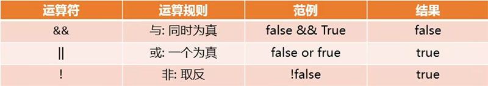
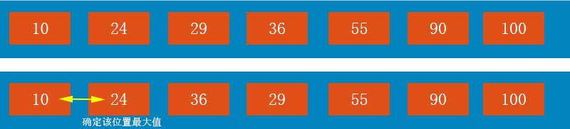

# <center>JavaScript基础入门</center>

## JavaScript组成

### 计算机语言分类：

- 编译型语言、解释性语言
- 动态类型语言、静态类型语言

**JavaScript语言组成：**`ECMAscript`、`DOM`、`BOM`

### JavaScript使用范围

- 网页交换
- 服务端开发（`node.js`）
- 命令行工具
- 桌面程序
- 移动端app、小程序
- 游戏开发

## 编写位置（html内）

1. 在`HTML`元素中直接执行。
2. 在元素内声明`JavaScript`。
3. 在`head`、`body`标签内添加`script`标签，在标签内书写。
4. 外部引入，`script`标签内添加src。

### **注意：**

`script`标签为双标签，不能用单标签表示。

## 交互方式

1. 弹出弹窗
2. 控制台打印
3. DOM操作
4. 接收用户输入的内容

## 变量

### 定义变量

```javascript
var 变量名称 = 变量赋值;
var name = ‘jmsht7355';
```

### 变量重写赋值

```javascript
var name = ‘jmsht7355';
name = 'newname';
```

### 声明赋值多个变量

```javascript
//方法1
var num1 , num2 , num3;
num1 = 1;
num2 = 2;
num3 = 3;
//方法2
var numA = 10, numB = 20, numC =30;
```

### 变量命名规则与规范

#### 命名规则：

1. 首个字符必须为字母或`_`或`$`。
2. 其他字符没有1中的限制。
3. 不能使用关键字和保留字。

#### 命名规范：

1. 多个单词使用驼峰标识。
2. 尽量不要用拼音作为变量名。

#### 变量交换

```javascript
//方法1 引入临时变量
var num1 = 100;
var num2 = 200;
var temp;
temp = num1;
num1 = mum2;
num2 = temp;
//方法2 利用加减特性进行交换(只对于数字有效)
var num1 = 100;
var num2 = 200;
num1 = num1 + num2;  //num1==300
num2 = num1 - num2; //num2==100
num1 = num1 - num2; //num1==200
```

## 基本数据类型

查看数据类型：`typeof`方法

### 数字类型（Number）

#### 数字表示范围：

**最小值：**`5e-324`；**最大值：**`1.7976931348623157e+308`。

```javascript
var age = 20;
var height = 1.88;
var tel = 18868807355;
var color = 0x10; //十六进制 输出结果为16
var eight = 0o10; //八进制 输出结果为8
var two = 0b10; //二进制 输出结果为2
```

#### NaN

即**非数值**（Not a Number）是一个特殊的数值，`JavaScript`中当对数值进行计算时，没有结果返回，则返回NaN。

#### **isNaN**

用于判断是否不是一个数字，不是数字返回true,是数字返回false。

### 字符串类型（String）

字符串的表示可用单引号或双引号。

```JavaScript
var name = "jmsht7355";
var city = "shanghai";
```

#### 转义字符

`\'`单引号,`\"`双引号,`\t`制表符,`\n`换行，`\b`退格符`\r`回车符。

```javascript
var message = "i say \'i will go home\'"; //输出message结果: i say 'i will go home'
```

#### 字符串的长度

```javascript
var name = jmsht7355;
console.log(name.length);
```

### 布尔类型（Boolean）

只有两个值：`true`，`false`

```javascript
var isOpen = true;
var isLight = false;
```

### 空类型（Null）

```javascript
var info = {name:'jmsht7355',age:18};
info = null;
```

### 未定义类型（undefined）

当一个变量进行了声明，但没有赋值，它的值就是`undefined`。

```javascript
var value = undefined; //不常用
var flag;
console.log(flag);
```

### 变量存储的本质

#### 内存的分类：

栈空间*stack*和堆空间*heap*

### 数据类型的转换

#### 将其他类型转为数字类型

**Number(其他类型);**

```javascript
//将字符串转成数字类型
var message1 = "123"
console.log(typeof message1);
var num1 = Number(message1);
console.log(num1,typeof num1); //转换为数字类型 123 number
var message2 = "abc";
var num2 = Number(message2);
console.log(num2,typeof num2); //NaN number

//将布尔类型转换成数字类型
console.log(Number(true)); //1
console.log(Number(false)); //0

//将undefined类型转换成数字类型
console.log(Number(undefined)); //NaN
//将	Null类型转换成数字类型
console.log(Number(null)); //0
```

**parseInt(string,radix)**

> 将字符串转换为整数，`radix`表示基数，可理解为进制。

**parseFloat(string)**

> 将字符串转换为浮点数

```javascript
var str1 = "123";
var num1 = parseInt(str1);
console.log(num1,typeof num1); //123 number

var str2 = "123.45";
var num2 = parseFloat(str2);
console.log(num2,typeof num2); //123.45 number

var str3 = "123abc";
var num3 = parseInt(str3);
console.log(num3,typeof num3); //123 number

var str4 = "abc123";
var num4 = parseInt(str4);
console.log(num4,typeof num4); //NaN number

var str5 = "123.45abc";
var num5 = parseFloat(str5);
console.log(num5,typeof num5); //123.45 number

var str6 = "abc123.45";
var num6 = parseFloat(str6);
console.log(num6,typeof num6); //NaN number
```

#### 将其他类型转为字符串类型

**toString()**

```javascript
//转换方式1
var num = 123;
var obj = null;
var message = undefined;
var flag = true;
console.log(num.toString()); //'123'
console.log(obj.toString()); //报错 无法调用
console.log(message.toString()); //报错 无法调用
console.log(flag.toString()); //'true'
//转换方式2
console.log(toString(num)); //'123'
console.log(toString(obj)); //'null'
console.log(toString(message)); //'undefined'
console.log(toString(flag)); //'true'
```

**隐式转换**

其他的数据类型在和字符串通过`+`运算符进行拼接时，会自动转换成字符串类型。

```javascript
var num = 123
var obj = null;
var message = undefined;
var flag = true;
console.log(num + ""); //'123'
console.log(obj + "") ; //'null'
console.log(message + ""); //'undefined'
console.log(flag  + "") ; //'true'
```

#### 将其他类型转为布尔类型

**Boolean()**

> 转换为false的五种特殊值`''`（空字符串）、0（包括0、-0）、undefined、null、NaN;其他值则转为true。

## 运算符

### 算术运算符


### 赋值运算符


### 关系运算符


### 逻辑运算符



### 运算符优先级


## 执行语句

### 默认执行顺序

1. 顺序：从上往下，顺序执行代码
2. 分支：根据条件判断，决定执行代码的分支
3. 循环：让特定代码重复执行

### if分支语句

#### 单分支结构if

```javascript
if (/*条件表达式*/){
    	//分支体/条件执行语句
    }

//简单示例1 小明成绩大于90，输出去游乐场玩
var score = prompt("小明，请输入你的分数：");
console.log(score,typeof score);
if (score > 90){
    console.log("去游乐场玩！");
}
```

#### 多分支结构if..else..

```javascript
if (/*条件表达式*/){
    	//分支体/条件执行语句
    }else{
    	//分支体/条件执行语句
}

//简单示例1 小明成绩大于90，输出去游乐场玩,否则输出去上补习班。
var score = prompt("小明，请输入你的分数：");
console.log(score,typeof score);
if (score > 90){
    console.log("去游乐场玩！");
} else{
    console.log("去上补习班！");
}
```

```javascript
if (/*条件表达式*/){
    	//分支体/条件执行语句
    }else if(/*条件表达式*/){
    	//分支体/条件执行语句
	}
	...
	 }else if(/*条件表达式*/){
    	//分支体/条件执行语句
	} else{
     	//分支体/条件执行语句   
    }

//简单示例1 陪女朋友过节日 如果是情人节，买玫瑰/看电影 如果是平安夜，买苹果/吃大餐，如果是生日，买蛋糕/开party，其他日子，上班工作
var holidayName = prompt("请输入今天的节日：");
if (holidayName === "情人节"){
    console.log("买玫瑰");
    console.log("看电影");
} else if (holidayName === "平安夜"){
    console.log("买苹果");
    console.log("吃大餐");
} else if (holidayName === "生日"){
    console.log("买蛋糕");
    console.log("开party");
} else{
     console.log("上班工作");
}
```

### switch分支语句

> 通过判断表达式的结果是否等于case语句的常量，来执行相应的分支体；只能做值相等的判断（使用全等运算符`===`）

```javascript
switch(变量/表达式){
    case 常量1;
    	分支体;
    	break;
    case 常量2;
    	分支体;
    	break;
    ...
     case 常量n;
    	分支体;
    	break;
    default;
    	分支体;
    	break;
}

//简单示例1 陪女朋友过节日 如果是情人节，买玫瑰/看电影 如果是平安夜，买苹果/吃大餐，如果是生日，买蛋糕/开party，其他日子，上班工作
var holidayName = prompt("请输入今天的节日：");
switch(holidayName){
	case "情人节";
    	console.log("买玫瑰");
    	console.log("看电影");
    	break; 
    case "平安夜";
    	console.log("买苹果");
   	 	console.log("吃大餐");
    	break; 
    case "生日";
   	 	console.log("买蛋糕");
    	console.log("开party");
    	break; 
    default;
    	console.log("上班工作");
    	break;
}
```

### 三元表达式

```javascript
表达式1 ? 表达式2 : 表达式3

//简单示例1 比较两个数字的大小，并获取较大的那个数字
var m = 20;
var n = 30;
var max = m > n ? m : n;

//简单示例2 判断一个人是否是成年人
var age = 28;
var result = age >= 18 ? "成年人" : "未成年人";

//判断要执行哪一个函数
function name1(){
    ...
}
function name2(){
    ...
}
var flag = true;
flag ? name1() : name2();
```

### while循环语句

```javascript
while(循环条件){
    //循环体
}
//简单示例1 判断一个人是否是成年人
var age = 20;
var i = 0;
while (i < 2,age >= 18){
    console.log("你是成年人");
    i++;
}

//简单示例2 打印0~99的数字
var i = 0;
while (i<100){
    console.log(i);
    i++;
}

//简单示例3 打印1~100的数字
var i = 0;
while (i<100){
    i++;
    console.log(i);
}

//简单示例4 计算0~99数字的和
var i = 0;
var sum = 0;
while (i < 100){
    sum += i;
    i++;
}

//简单示例4 计算0~99数字中奇数的和
var i = 0;
var sum = 0;
while (i < 100){
    if (i%2 == 0 ){
    	sum += i;	
    }  
    i++;
}
```

### do..while循环语句

> 不管条件是否成立，do..while循环都会先执行一次

```javascript
do {
    //循环体
} while(循环条件)

//简单示例1 打印10次hello world
var i = 0;
do {
    console.log('hello world');
    i++;
} while(i < 10)
    
//简单示例2 打印0~99的数字 并计算他们的和
var i = 0;
var sum = 0;
do {
    sum += i
    console.log(i);
    i++;
} while(i < 100)
console.log(sum);
```

### for循环语句

```javascript
for (初始表达式1;条件表达式2;自增/自减表达式3){
    //循环体
}

//简单示例1 打印10次hello world
for (var i = 0; i < 10; i++){
    console.log('hello world');
}

//简单示例2 打印0~99的数字 
for (var i = 0; i < 100; i++){
     console.log(i);
}

//简单示例3 打印100~1的数字
for (var i = 100; i > 0; i--){
     console.log(i);
}

//简单示例4 计算0~99的和
var sum = 0;
for (var i = 0; i <100; i--){
     sum += i;
}
//简单示例5 分别计算0~99中奇数与偶数的和
var oddTotal = 0;
var evenTotal = 0;
for (var i = 0; i <100; i--){
     if (i % 2 ==0){
         evenTotal  += i;
     }else{
         oddTotal  += i;
     }
}
```

### for循环嵌套

```javascript
//简单示例1 在屏幕上打出一个6*6‘*’矩形
for (var i = 0; i < 6; i++ ){
    for (var j = 0; j < 6; j++ ){
        document.write('*');
        document.write(' ');
    }
    document.write('<br>');
}
//简单示例2 在屏幕上打出一个‘*’三角形
for (var i = 0; i < 6; i++ ){
    for (var j = 0; j < i + 1; j++ ){
        document.write('*');
        document.write(' ');
    }
    document.write('<br>');
}

//简单示例3 在屏幕上打出一个九九乘法表
for (var i = 1; i < 10; i++ ){
    for (var j = 1; j < i+1 ; j++ ){
        document.write("'<spean>' + j + '*' + i + '=' + i*j + '</spean>' ");
    }
    document.write('<br>');
}
```

### 循环跳转

```javascript
//简单示例1 打印0~99的数字 不打印5
for (var i = 0; i < 100; i++){
    if（i === 5）{
       continue;
    }
     console.log(i);
}

//简单示例1 打印0~99的数字 遇到5时不再数字
for (var i = 0; i < 100; i++){
    if（i === 5）{
       break;
    }
     console.log(i);
}
```

## 数组

### 数组的定义

```javascript
var movies = ['海王','指环王','罗马王'];
```

### 数组的基本操作

```javascript
//获取数组的长度
var movies = ['海王','指环王','罗马王'];
console.log(movies.length);

//获取数组的索引值
var m = movies[1]; //获取第二个值
console.log(m);
```

### 数组的遍历/迭代

对数组的每一个元素都访问一次。

```javascript
//简单示例1 正向遍历数组的元素
var names = ['jmsht7355','kebe','james','jodn','chuanpu']
for (var i = 0; i < names.length; i++){
    console.log(names[i]);
}

//简单示例2 反向遍历数组的元素
var names = ['jmsht7355','kebe','james','jodn','chuanpu']
for (var i = names.length - 1; i >= 0; i--){
    console.log(names[i]);
}
```

### 数组中元素的拼接与分割

```javascript
//简单示例1 将数组中所有的算是使用-进行分割
var message = '';
var names = ['jmsht7355','kebe','james','jodn','chuanpu']
for (var i = 0; i < names.length; i++){
    if (i !== names.length -1){
        break;
        message += names.[i] + '-';
    } 
}
console.log(message)
```

### 数组简单示例

```javascript
var nums = [10,100,23,24,45,75,144];

//求数组中的数字的和与平均值
var sum = 0;
for (var i = 0; i < nums.length; i++){
    sum += nums[i];
}
var avar = sum / nums.length;

//找出数组中的最大值
var max = nums[0];
var sum = 0;
for (var i = 0; i < nums.length; i++){
    if(max < nums[i]){
        max = nums[i]
    }
}
```

### 反转数组

```javascript
var nums = [100,10,36,24,29,55,90];
var temp = 0;
//反转数组中的元素
for (var i = 0; i < nums.length / 2; i++){
    temp = nums[i];
    nums[i] = nums[nums.lelngth - 1 - i];
    nums[nums.lelngth - 1 - i] = temp;
}
```

### 数组的排序算法

- 冒泡排序、选择排序、插入排序
- 堆排序、希尔排序、快速排序

### 冒泡排序

将数组内的元素两两进行比较若前者大于后者，则将位置进行交换。

#### 将数组[100,10,36,24,29,55,90]进行冒泡排序

**第一轮排序:**


**第二轮排序:**


**第三轮排序:**


**第四轮排序:**


**第五轮排序:**


**第六轮排序:**



```javascript
var nums = [100,10,36,24,29,55,90];
var temp = 0;
for (var j = nums.length - 1 ; j > 0; j-- ){
    for (var i = 0; i < j; i++){
   		 if (nums[i] > nums[i +1 ]){
        	temp = nums[i];
        	nums[i] = nums[i + 1];
        	nums[i + 1] = temp;
    }
}
}
```

### 选择排序

将元素内的每个元素依次与其他元素进行比较，若前者大于后者，则进行位置交换。

#### 将数组[100,10,36,24,29,55,90]进行选择排序

**第一轮排序:**


**第二轮排序:**


**第三轮排序:**


**第四轮排序:**


**第五轮排序:**


**第六轮排序:**


```javascript
function arrPx(arr){
    for (var j = 0; j < arr.length; j++){
        for (var i = j + 1; i < arr.length; i++){
            if(arr[j] >arr[i]){
                var temp = arr[i];
                arr[j] = arr[i];
                arr[i] = temp;
            }
        }
    }
}

var num1 =[100,10,36,24,29,55,90];
arrPx(num1);
console.log(num1);
```

## 函数

**编程范式：**面向对象编程（Java/C++/JavaScript（基于对象））、面向过程编程（C）、函数式编程（JavaScript、lisp/scheme）

> 函数其实就是对某段代码的封装，这段代码帮助我们完成某一项功能。

### 函数的定义

```javascript
function 函数名(){
    //封装的代码
}

//定义一个打印名字的函数
function printName(){
    console.log('jmsht7355');
}
```

### 函数的调用

```javascript
//定义一个打印函数
function printName(){
    console.log('jmsht7355');
}

//调用上述函数
printName();
```

### 函数的参数传递

```javascript
//定义一个打印函数、带有name参数
function printName(name){
    console.log('name');
}

//调用上述函数
printName(jmsht7355);
```

> 定义函数的参数为形式参数（形参）; 调用函数的参数为实际参数（实参）

### 函数的简单示例

```javascript
//计算两数之和
function sum(num1,num2){
    var result = num1 + num2;
    return result;
}
var total = sum(10,20);

//计算1~n数字的和
function sum (n){
    var sum = 0;
    for (var i = 0; i < n; i++){
   		 sum += i;
    }
    return sum;
}
var res = sum(100);

//传入一个数组，对数组进行反转
function arrFz (nums){
    for (var i = 0; i < nums.length / 2; i++){
    	var	temp = nums[i];
    	nums[i] = nums[nums.lelngth - 1 - i];
   		nums[nums.lelngth - 1 - i] = temp;
	}
    return nums;
}
//调用数组反转函数
var num2 = [10,60,30,40,551,52];
num2 = arrFz (num2);
console.log(num2);
```

### 函数的返回值

**注意：**

1. 函数中执行了return操作,后续的代码不再执行。

2. 若函数中没有return语句，则默认返回值为undefined。
3. 如果函数中return后没有其他内容，相当于return undefined。

### 函数的递归调用

1. 一个函数中可以调用另一个函数。

2. 函数可以调用自己（递归调用）。

```javascript
//函数调用其他函数
function test1(){
    test2();
}
function test2(){}
test1();

//函数自己调用自己
function test1(){
    test1();
}
```

### argument参数

argument对象：在函数当中。

默认情况下argument对象是所有（非箭头）函数中都可用的局部变量。

该对象中存放着所有的调用者传入的参数。

```javascript
function sum(num1,num2){
    var result = num1 + num2;
    console.log(argument);
    return result;
}
var total = sum(10,20,30,40,50); //javascript 允许实参多于形参
```

### 全局变量与局部变量

#### 变量的作用域

变量的使用范围。在JavaScript（ES5）没有块级作用域。

- 块级作用域（ES2015）
- 函数作用域：函数内部存在作用域。

#### 函数的作用域

1. 在全局默认是不能访问局部的变量。
2. 在函数中，访问一个变量时，会优先查找自己的局部变量，若没有找到，会查找全局变量。

#### 局部变量

定义在函数内部的变量为局部变量。

#### 全局变量

定义在`script`标签内部的变量（除函数内）为全局变量。

### 函数的表达式写法

```javascript
var fn = function test1(){}
fn();
```

### 立即执行函数

`IIFE`即立即调用函数表达式。

> JavaScript不允许直接在一个函数的声明后跟（）执行这个函数。立即执行函数执行完后会立即销毁。

```javascript
//表达式1
var fn = function test(){ 
	console.log('立即执行！')
}()

//表达式2
(function (){ 
	console.log('立即执行！')
})()

//表达式3
(function (){ 
	console.log('立即执行！')
}())
```

### 值传递和引用传递

```javascript
//值传递
function test(name){
    console.log(name);
    name = "kebe"
}
var temp = 'jmsht7355';
test(temp);
console.log(temp); //输出结果 jmsht7355

//引用传递
function test(arr){
    arr[0] = "abc";
}
var temp = [10,20,30];
test(temp);
console.log(temp); //输出结果 [abc,20,30]
```

