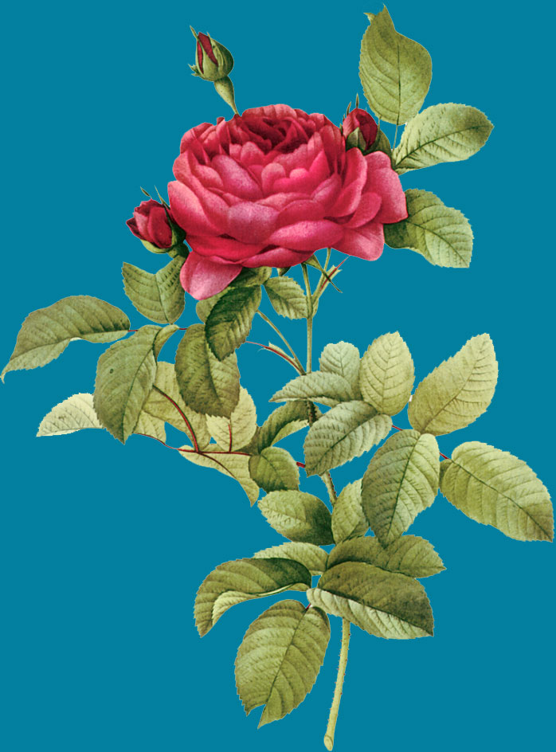
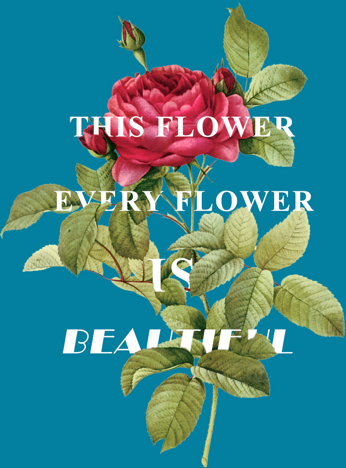
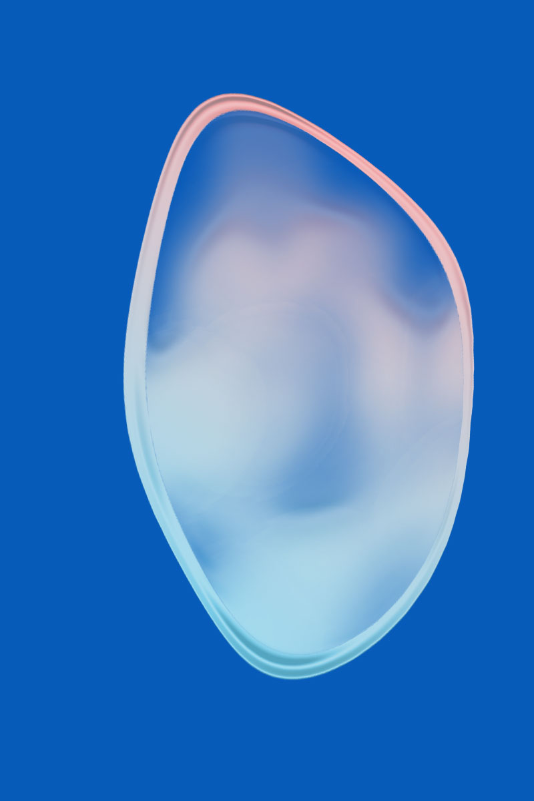

# PS实例练习

## 图文穿插效果

使文字融入到图像中，使整个图片展现出一定的层次感（使图片中的枝叶对英文文字产生遮盖的效果）。

原图如下：

1. 在该图片用ps打开，添加文字内容。在每一个需要遮盖的文字图层，添加蒙版。
2. 选中图像图层，按住`Ctrl`，用鼠标左键，选中图层，使图层产生选区效果。
3. 选择画笔工具，按住`Alt`，用鼠标右键拖拽，选择画笔大小。
4. 用画笔工具对文字图层进行涂抹（注意前景色为黑色，后景色为白色），产生图片与文字的层次效果。

实际效果如下图：

## 透明气泡效果

1. 用椭圆工具画一个椭圆用混合工具中的渐变效果。
2. 用浮雕（内斜面）调节一定的参数，选择适合的等高线样式。
3. 选择椭圆，添加蒙版，确定蒙版选区，进行缩小，形成渐变的圆环效果。填充蒙版，使蒙版成为内黑外白。
4. 利用画笔工具，选择一定的透明度进行填充擦拭。
5. 对椭圆所在图层进行自由变换`Ctrl + T`，右键进行扭曲、变形，做成相似或所需要的效果。
6. 填充背景图层（用深色效果）。

