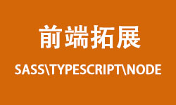
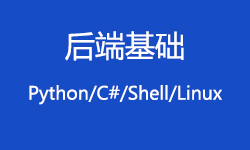
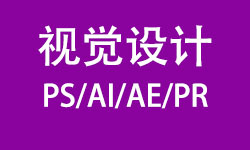

# 技术胶囊

`主要以前端相关技术为主的学习路线涉及PC、移动端、多端的适配、业界主流的前端技术栈内容，以及相关辅助工具（后端基础技术、文档相关、及Linux基础等）。`

## 基础相关技术

`涉及基础操作配置及简单工具使用如vim、git、markdown等包含文档书写、版本控制、文本编辑（包含编程软件的使用）。`

###  [vim简单配置](vim简单配置.md)

 `vim`文本编辑器的简单配置，常用于`Linux`服务器中修改配置文件等操作，是后端必备的技能配置。

### [git基础及命令](git基础及命令.md)

 `git`是程序员必须掌握的版本控制软件。

### [markdown基本语法](markdown基本语法.md)

 `markdown`语法是相对来说适合编写文档的必要语法。

## 前端基础技术

`传统Html、Css、JavaScript,及其内容延申,(如html中特殊标签的使用、css中版本，语法涉及布局、样式、定位、盒模型等重要概念，以及JavaScript中相关重要内容)。`

### [html+css入门](html+css入门.md)

 前端基础三件套之二，必须熟练掌握。

### [flex基础入门](flex基础入门.md)

 `css`布局中的经典布局，常用于手机端布局。

### [ajax入门](ajax入门.md)

 前端前十年的革新技术。加快了浏览器与用户交互的历程。

### [JavaScript基础入门](JavaScript基础入门.md)

 前端基础三件套之一，基础内容主要包含数据类型、逻辑结构、基础语法等。

### [JavaScript高级](JavaScript高级.md)

 前端基础三件套之一，高级内容主要包含闭包、面向对象、函数、`ES6`等。

## 前端基础拓展

`除三件套以外涉及延申内容如（Sass、Typescript、Node等）。`

### [sass基础入门](sass基础入门.md)

 `css`的一种预处理器，优化`css`语法书写。

### [Typescript基础入门](typescript基础入门.md)

 `JavaScript`的超集，前端现阶段必须要掌握的语言之一。

## 前端相关框架

`前端流行框架（Vue、React）及工程化、框架相关内容，延申前端UI框架、模块化编程、响应式编程、浏览器适配、等工程化问题。`

###  [axios入门](axios入门.md)

 `ajax`常用`JavaScript`框架。

###  [vue基础入门](vue基础入门.md)

 `Vue` (读音 /vjuː/，类似于 **view**) 是一套用于构建用户界面的**渐进式框架**。前端三大视图框架之一。

###  [vue工程化基础配置](vue工程化基础配置.md)

 前端三大视图框架之一。基本相关配置及组织架构。

###  [vite基础入门](vite基础入门.md)

 `Vite`（法语意为 "快速的"，发音 `/vit/`，发音同 "veet")是一种新型前端构建工具，能够显著提升前端开发体验。

###  [react基础入门](react基础入门.md)

 `React` 是一个用于构建用户界面的 JavaScript 库。前端三大视图框架之一。

###  [bootstrap基础入门](bootstrap基础入门.md)

 `Bootstrap` 是全球最流行的前端开源工具包，它支持` Sass `变量和 `mixins`、响应式网格系统、大量的预建组件和强大的 `JavaScript `插件，助你快速设计和自定义响应式、移动设备优先的站点。

## 后端基础技术

后端脚本或编译性语言、linux基础技术等相关内容

`后端相关基础知识包含后端基本语言、数据库、及相关概念，还有Linux相关知识。`

###  [python基础入门](python基础入门.md)

 `Python`提供了高效的高级数据结构，还能简单有效地面向对象编程。`Python`语法和动态类型，以及解释型语言的本质，使它成为多数平台上写脚本和快速开发应用的编程语言， 随着版本的不断更新和语言新功能的添加，逐渐被用于独立的、大型项目的开发。

## 移动端应用技术

`涉及微信小程序、h5、以及华为鸿蒙相关应用程序等移动端原始应用开发与工程搭建等相关内容。`

### [微信小程序入门](微信小程序入门.md)

 微信小程序是一种全新的连接用户与服务的方式，它可以在微信内被便捷地获取和传播，同时具有出色的使用体验。

## 设计相关技术

`涉及平面设计、网站UI设计、视频特效、视频剪辑、主要为adobe全家桶的学习。`

### [PS基础入门](PS基础入门.md)

 涉及PS软件最基础知识及相关内容概念。

### [PS实例练习](PS实例练习.md)

 根据基础的PS相关知识，提供的简单实例。