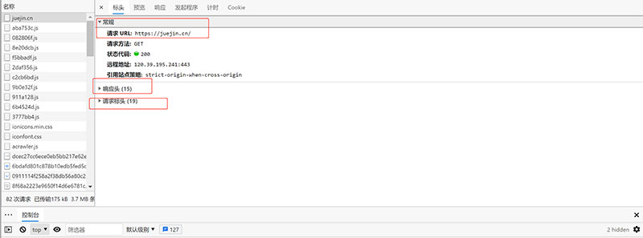
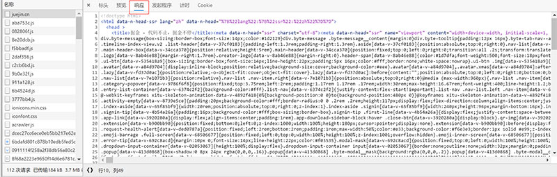

# <center>Ajax入门</center>

## ajax定义与使用范围与作用

定义：异步的`JavaScript`和`xml`。

作用：通过`Ajax`可用浏览器向服务器发送异步请求，且无需**数据刷新**。

**优点**：

1. 可以无需刷新页面与服务器进行通信。

2. 允许你根据用户事件来更新部分页面内容。

**缺点**：

1. 没有历史记录，不能回退。
2. 存在跨域问题（同源）。
3. `SEO`不友好。

## XML

定义：可拓展标记语言（用于传输和存储数据）。

## json

同样用于数据的传输与存储，已取代`XML`。

##  HTTP协议

定义：超文本传输协议。

### **请求**：

- 请求行：

  ​	请求类型（GET、POST等）+  url + HTTP协议版本

- 请求头

- 请求空行

- 请求体

### 响应：

- 响应行：
- 响应头
- 响应空行
- 响应体

### 浏览器检查

<br>



<br>



<br>

## Express框架

### 安装

```shell
npm install express
```

### 使用

```javascript
//1.引入express
const express = require('express');
//2.创建应用对象
const app = express();
//3.创建路由规则
//reguest 是对请求报文的封装
//response 是对响应报文的封装
app.get('/',(reguest,response)=>{
    //设置响应
    response.send('HELLO EXPRESS');
});
//4.监听端口启动服务
app.listen(8000,()=>{
    console.log("服务已启动，8080端口监听中……");
})
```

### 启动

```shell
node + 上述js文件
```

## ajax操作基本步骤

### **简单案例-发送get请求**

```javascript
  //获取button元素
        const btn = document.getElementsByTagName('button')[0];
        const result = document.getElementById("result");
        //绑定事件
        btn.onclick = function () {
            //1.创建对象
            const xhr = new XMLHttpRequest();
            //2.初始化 设置请求方法和url
            xhr.open('GET', 'http://127.0.0.1:8000/server');
            //3.发送
            xhr.send();
            //4.事件绑定 处理服务器返回的结果
            xhr.onreadystatechange = function () {
                //判断 （服务端返回了所有的结果）
                if (xhr.readyState === 4) {
                    //判断响应状态码 200 404 403 401 500 等
                    //2XX 成功
                    if(xhr.status >= 200 && xhr.status <300){
                        //处理结果 行 头 空行 体
                        //响应行
                        // console.log(xhr.status); //状态码
                        // console.log(xhr.statusText); //状态字符串
                        // console.log(xhr.getAllResponseHeaders());//所有响应头
                        // console.log(xhr.response);//响应体
                        
                        //设置result 文本
                        result.innerHTML = xhr.response;
                    }else{
                    
                    }
                }
            }

        }
```

####  参数设置

```javascript
xhr.open('GET', 'http://127.0.0.1:8000/server?a=100&b=200&c=300');
```
### **简单案例-发送post请求**

```javascript
 //获取元素对象
        const result = document.getElementById("result");
        //绑定事件
        result.addEventListener("mouseover",function(){
            //1.创建对象
            const xhr = new XMLHttpRequest();
            //2.初始化 设置类型与url
            xhr.open('POST','http://127.0.0.1:8000/server');
            //3.发送
            xhr.send();
            //4.事件绑定
            xhr.onreadystatechange = function(){
                //判断 （服务端返回了所有的结果）
                if (xhr.readyState === 4) {
                    //判断响应状态码 200 404 403 401 500 等
                    //2XX 成功
                    if(xhr.status >= 200 && xhr.status <300){
                        //处理结果 行 头 空行 体
                        //响应行
                        // console.log(xhr.status); //状态码
                        // console.log(xhr.statusText); //状态字符串
                        // console.log(xhr.getAllResponseHeaders());//所有响应头
                        // console.log(xhr.response);//响应体

                        //设置result 文本
                        result.innerHTML = xhr.response;
                    }else{

                    }
                }
            }
        });
```

