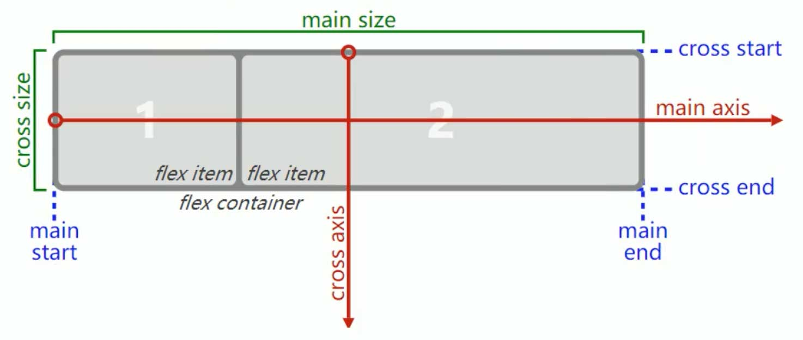

# <center>flex基础入门</center>

## 兼容问题

ie6-9兼容性较差。

## 重要概念

开启flex布局的元素叫`flex container`。

`flex container`里面的直接子元素叫做`flex items`。

## 开启flex布局

**父盒子**

```css
/*块级元素*/
/*行内元素*/
display:flex;  				
display:inline-flex;		
```

## flex container 属性

### flex-direction

`flex items` 默认是沿着` main start` （主轴）开始往`main end `方向排布。



```css
flex-direction: row;   //默认 从左到右
flex-direction: row-reverse; //主轴反向 从右到左
flex-direction: column; //主轴 从上到下
flex-direction: column-reverse;  //主轴 从下到上
```

### justify-content

`justify-content`决定了`flex items`在·`main axis` 上的对齐方式。

```css
justify-content:flex-start;	//默认 从main start对齐
justify-content:flex-end;	//从main end对齐
justify-content:center      //居中对齐
justify-content:space-between; //空间对齐 两边子盒子顶格，中间子盒子居中
justify-content:space-evenly;	//空间对齐  各个子盒子的间距相等
justify-content:space-around;	//空间对齐  两边子盒子的间距是中间子盒子间距的一半
```

### align-items

`align-items`决定了`flex items`在`cross axis`上的对齐方式。

```css
align-items:normal;		//默认
align-items:stretch;   //当flex items 在main axis方向的size为auto时，会自动拉伸至填充父盒子
align-items:flex-start; //与 cross start 对齐
align-items:flex-end;	//与 cross end 对齐
align-items:center;		//居中对齐
align-items:baseline;	//与基准线对齐
```

### flex-wrap

```css
flrx-wrap:no-wrap;	//默认 单行显示
flrx-wrap:wrap;		//换行显示
flrx-wrap:wrap-reverse;  //在交叉轴上反向换行显示

```

### flex-flow

`flex-direction` || `flex-wrap` 缩写属性、

### align-content

`align-content`决定了多行`flex items`在`cross axis`上的对齐方式，用法与`justify-content`类似

```css
align-content:stretch;		//默认
align-content:flex-start;	//从cross start对齐
align-content:flex-end;	//从cross end对齐
align-content:center      //居中对齐
align-content:space-between; //空间对齐	上下子盒子顶格，中间子盒子居中
align-content:space-evenly;	//空间对齐  各个子盒子的间距相等
align-content:space-around;	//空间对齐  上下子盒子的间距是中间子盒子间距的一半
```

## flex items 属性

### align-self

```css
align-self:auto				//默认
align-self:flex-end			//子盒子底部对齐
```

### flex-grow

子盒子sum值的大小大于1，将父盒子的宽度按对应比例进行均分；

子盒子sum值的大小小于等于1，将父盒子的宽度与值相乘得到对应的宽度。

```css
flex-grow:1;		
```

### flex-shrink

子盒子sum值的大小大于1，超出的size*收缩比例/所有子盒子的收缩比例之和；

子盒子sum值的大小小于等于1，每个子盒子收缩的size为子盒子父盒子的size\*sum\*收缩比例/所有子盒子的收缩比例之和。收缩比例 = `flex-shrink`\*子盒子的`base sise`。

```css
flex-shrink:1;
```

### flex-basis

`flex-basis`用来设置子盒子在`main axis`方向上的`base size`。

```css
flex-basis:auto; //默认
```

### flex

`flex`是`flex-grow`||`flex-shrink`||`flex-basis`的缩写。

