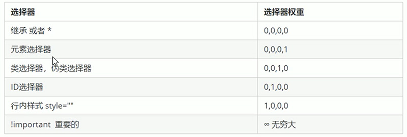
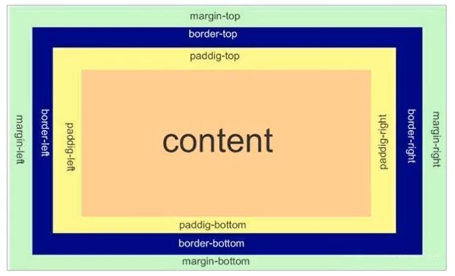
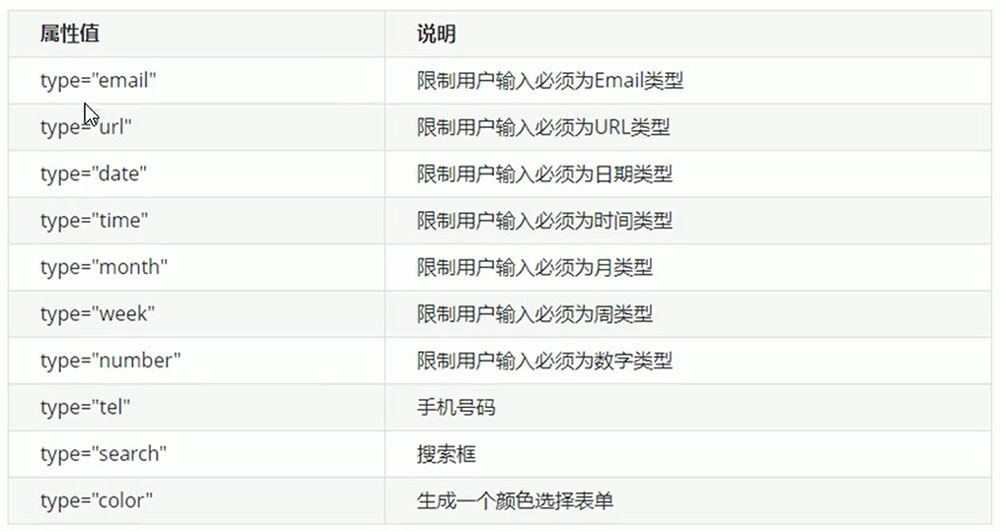

# <center>HTML+CSS入门</center>

## HTML标签

### <!DOCTYPE>标签

文档类型声明标签。写在文档最前面的位置。

### lang语言种类

该属性对浏览器和搜索引擎有用。

1. en
2. zh-CN

### meta标签

#### 属性：

charset:字符集（UTF-8、GB2312、BIG5、GBK）

### 标题标签

```html
<h1>h1</h1>
<h2>h2</h2>
<h3>h3</h3>
<h4>h4</h4>
<h5>h5</h5>
<h6>h6</h6>
```

### 段落标签

```html
<p></p>
```

### 换行标签

```html
<br/>
```

### div标签

```html
<div></div>
```

### span标签

```html
<span></span>
```

### img标签

```html

```

### 超链接标签

```html
<a href=""></a>
```

### 表格标签

```html
<table>
    <tr>
        <td></td>
    </tr>
</table>
```

### 列表标签

#### 无序列表

```html
<ul>
    <li></li>
</ul>
```

#### 有序列表

```html
<ol>
    <li></li>
</ol>
```

### 表单标签

一个完整的表单通常有表单域、表单控件（表单元素）、提交信息这三部分组成。

#### 表单域

```html
<form action=""></form>
```

#### 表单元素

input输入表单元素：

```html
<input type="text">
```

select下拉表单元素：

```html
<select name="" id=""></select>
```

textarea文本域元素：

```html
<textarea name="" id="" cols="30" rows="10"></textarea>
```

## css书写顺序

1. 布局定位属性
2. 自身属性
3. 文本属性
4. 其他属性

## CSS属性

### 选择器

#### 类选择器

```css
.类名{
    属性
    ……
}
```

#### id选择器

```css
#id名{
    属性
    ……
}
```

#### 通配符选择器

```css
* {
    属性
    ……
}
```

#### 后代选择器

元素2是元素1的后代。

```css
元素1 元素2 {
属性
    ……
}
```

#### 子元素选择器

只能选择作为某元素的最近一级子元素。

```css
元素1 > 元素2 {
属性
    ……
}
```

#### 并集选择器

可以选择多组标签，同事为他们定义相同的样式，通常用于集体声明。

```css
元素1,元素2 {
属性
    ……
}
```

#### 伪类选择器

通常用于向某些选择器添加特殊效果，或选择第一个，第n个元素。

链接伪类：

```css
a:link /* 选择所有未被访问的链接 */
a:visited /* 选择所有已被访问的链接 */
a:hover /* 选择鼠标指针位于其上的链接 */
a:active /* 选择活动链接（鼠标按下未弹起的链接） */
```

:focus伪类选择器：

用于获取焦点的表单元素。

```css
input:focus {
    属性
    ……
}
```


### 字体属性

```css
/* 字体系列 */
font-family: 'Franklin Gothic Medium', 'Arial Narrow', Arial, sans-serif;

/* 字体大小 */
font-size:18px ;

/* 字体粗细 */
font-weight: bold;
font-weight: 500;

/* 字体样式 */
font-style: normal;
/* 斜体 */
font-style: italic;
```

### 文本属性

```css
/* 文本颜色 */
color: white;

/* 文本对齐 */
text-align: center;

/* 装饰文本 */
/* 下划线 */
text-decoration: underline;
/* 上划线 */
text-decoration: overline;
/* 删除线 */
text-decoration: line-through;

/* 文本缩进 */
text-indent: 18px;

/* 行间距 */
line-height: 24px;
```

### 元素分类

#### 块级元素

1. 独占一行。
2. 高度、宽度、内外边距都可以控制。
3. 宽度默认是容器（父级宽度）的100%。
4. 是一个容器及盒子，里面可以放行内元素或块级元素。

#### 行内元素

1. 相邻行内元素在同一行内（可多个显示）
2. 宽高直接设置是无效的。
3. 默认宽度就是它本身内容的宽度。
4. 只能容纳文本或其他行内元素。

#### 元素显示模式转换

```css
/* 转化为块级元素 */
display: block;

/* 转化为行内元素 */
display: inline;

/* 转化为行内块 */
display: inline-block;
```

### 文字垂直居中

让文字的行高等于盒子的高度。

### 背景属性

```css
/* 背景颜色 */
background-color: #fff;
background: rgba(red, green, blue, 0.5);

/* 背景图片 */
background-image: url();

/* 背景平铺 */
background-repeat: no-repeat;
background-repeat: repeat;
background-repeat: repeat-x;
background-repeat: repeat-y;

/* 背景位置 */
background-position: x y;
background-position: /* 方位名词*/;
background-position: center;

/* 背景固定 */
background-attachment: fixed;
```

### css优先级

- 选择器相同，则执行层叠性
- 选择器不同，则根据选择器**权重**执行



## 盒模型



### 边框属性

```css
/* 边框粗细 */
border-width: 1px;

/* 边框样式 */
border-style: none;

/* 边框颜色 */
border-color: beige;
```

### 内边距

```css
padding-left: 10px;
padding-right: 10px;
padding-top: 10px;
padding-bottom: 10px;
padding: 10px;
padding: 10px 0;
```

### 外边距

```css
margin-left: 10px;
margin-right: 10px;
margin-top: 10px;
margin-bottom: 10px;
margin: 10px;
margin: 10px 0;
```

### 行内元素水平居中

给其父元素添加文本居中。

### 圆角矩形（边框）

```css
border-radius: 5px;
```

### 盒子阴影

```css
box-shadow: 5px 5px 5px 5px rgba(0 , 0 , 0 , 0.3);
```

### 文字阴影

```css
text-shadow: 5px 5px 5px 5px rgba(0 , 0 , 0 , 0.3);
```

### 浮动

```css
float: left;
float: right;
```

### 清除浮动

给父元素添加overflow属性

## css定位

定位 = 定位模式 + 边偏移

### 静态定位

元素的默认定位i方式。

### 相对定位

1. 是相对于它原来的位置。
2. 不脱离标准流（继续保留原来的位置）。

```css
选择器 {
    position: relative;
}
```

### 绝对定位

1. 没有父元素或祖先元素没有定位，则以浏览器为准定位。
2. 祖先元素有定位，则以最近一级的祖先元素为参考移动位置。

```css
选择器 {
    position: absolute;
}
```

### 固定定位

1. 以浏览器的可视窗口作为参考移动位置。
2. 跟父元素没有任何关系。
3. 不随滚动条滚动。
4. 不占有原先的位置。

```css
选择器 {
    position: fixed;
}
```

### 绝对定位的盒子居中

1. 不能通过`margin: 0 auto;`水平居中。
2. `left:50%;margin-left:/*盒子宽度的一半*/;`

## 元素的显示与隐藏

### display

隐藏元素后，不再占有原来的位置。

```css
/* 隐藏对象 */
display: none;
/* 转换元素属性,显示元素 */
display: block;
```

### visibility

隐藏元素后，继续占有原来的位置。

```css
visibility: hidden;
visibility: visible;
```

### overflow

对溢出内容进行显示或隐藏。

```css
overflow: hidden;
overflow: scroll;
overflow: visible;
overflow: auto;
```

## css高级

### 精灵图

缺点：

1. 图片文件较大。
2. 图片本身放大会失真。
3. 更换较为复杂。

```css
background-position: x, y;
```

### 字体图标

优点：

1. 轻量级。
2. 灵活性（本质是文字，可实现诸多效果）。
3. 兼容性较好，几乎支持所有的浏览器。

使用：

1. 把下载的文件夹放入页面根目录。
2. 在css中全局声明字体（通过css引入）。
3. 匹配字体名字。
4. 设置字体图标样式。

### css三角

```css
width: 0;
height: 0;
border-top: 5px solid;
border-left: 5px solid;
border-right: 5px solid;
border-bottom: 5px solid;
```

### 溢出文字以省略号显示

#### 单行文字溢出显示省略号

1. 强制一行内显示文本
2. 超出部分隐藏
3. 溢出部分文字用省略号替换

```css
white-space: nowrap;
overflow: hidden;
text-overflow: ellipsis;
```

#### 多行文字溢出显示省略号

```css
overflow: hidden;
text-overflow: ellipsis;
/* 弹性盒子显示 */
display: -webkit-box;
/* 限制在一个块元素显示的文本行数 */
-webkit-line-clamp: 2;
/* 设置或检索伸缩盒子对象子元素的排列方式 */
-webkit-box-orient: vertical;
```

## css初始化

可参考w3c标准，或进行特别定制。

## HTML5

### 新增语义标签

```html
<!-- 头部标签 -->
<header></header>
<!-- 导航标签 -->
<nav></nav>
<!-- 内容标签 -->
<article></article>
<!-- 定义文档某个区域 -->
<section></section>
<!-- 侧边栏标签 -->
<aside></aside>
<!-- 尾部标签 -->
<footer></footer>
```

### 多媒体标签

#### 音频标签：

一般选择MP3作为导入音频格式。

```html
<audio src=""></audio>
```

#### 视频标签：

一般选择MP4作为导入视频格式。

```html
<video src=""></video>
```

### 表单标签input类型



