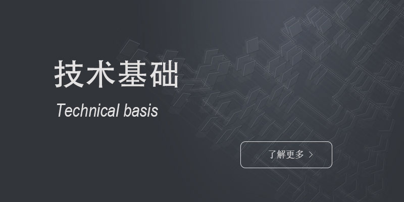

# 
技术之家，纵横寰宇

***

<h4 >天道必酬勤，书山勤为路</h4>

 
 

<table ><tr><td bgcolor="#f7f7f7">主要以前端相关技术为主的学习路线涉及PC、移动端、多端的适配、业界主流的前端技术栈内容，以及相关辅助工具（后端基础技术、文档相关、及Linux基础等）</td></tr></table>

 

# 
中文文档，查漏补缺

***

<h4 >海纳从百川，源头活水来</h4>

 
 

<table ><tr><td bgcolor="#eff6ff">本页面的中文文档资源，大部分为官方中文文档，小部分为中文手册等辅助开发工具，仅作为查阅使用。若链接地址有误，本人会及时更正。</td></tr></table>

 

# 
项目工程，万里之行

***

<h4 >跬步至千里，水滴坠石穿</h4>

 
 

<table ><tr><td bgcolor="#f4fff5">前端学习中相关技术栈的学习，如简单静态博客的搭建、相关网页的设计、pc、移动端等多端应用的开发及工程配置，后期会涉及后端方面的工程以及Linux相关的配置与使用。</td></tr></table>

 

